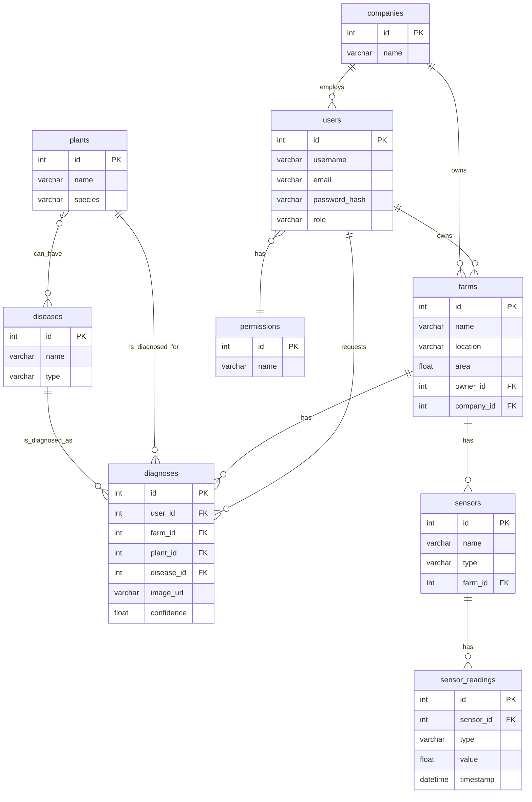

# توثيق مخطط قاعدة البيانات لنظام Gaara AI

**الإصدار:** 2.0.0  
**تاريخ التوثيق:** 2025-11-15  
**الموثق:** Manus AI

---

## مقدمة

هذا المستند يوفر توثيقاً كاملاً لمخطط قاعدة البيانات (Database Schema) المستخدم في نظام Gaara AI. تم تصميم المخطط ليكون شاملاً وقابلاً للتوسع، مع التركيز على العلاقات المنطقية بين الكيانات المختلفة.

---

## رسم توضيحي للعلاقات (Entity-Relationship Diagram - ERD)

---

## تفاصيل الجداول

### 1. جدول المستخدمين (`users`)

يخزن معلومات المستخدمين، صلاحياتهم، وإعداداتهم.

| اسم الحقل      | النوع        | الوصف                                       |
| :-------------- | :---------- | :----------------------------------------- |
| `id`            | `Integer`   | المعرف الرئيسي (PK)                         |
| `username`      | `String(80)`| اسم المستخدم الفريد                         |
| `email`         | `String(120)`| البريد الإلكتروني الفريد                    |
| `password_hash` | `String(255)`| كلمة المرور المشفرة                        |
| `role`          | `String(20)`| دور المستخدم (admin, user, etc.)             |
| `is_active`     | `Boolean`   | هل الحساب نشط؟                             |
| `company_id`    | `Integer`   | مفتاح خارجي لجدول الشركات (FK)             |
| `created_at`    | `DateTime`  | تاريخ إنشاء الحساب                         |

### 2. جدول الشركات (`companies`)

يخزن معلومات الشركات التي ينتمي إليها المستخدمون.

| اسم الحقل | النوع         | الوصف                  |
| :-------- | :----------- | :--------------------- |
| `id`      | `Integer`    | المعرف الرئيسي (PK)   |
| `name`    | `String(200)`| اسم الشركة            |
| `email`   | `String(120)`| البريد الإلكتروني للشركة |
| `country` | `String(50)` | بلد الشركة            |

### 3. جدول المزارع (`farms`)

يخزن معلومات المزارع المملوكة للمستخدمين أو الشركات.

| اسم الحقل   | النوع      | الوصف                               |
| :----------- | :-------- | :--------------------------------- |
| `id`         | `Integer` | المعرف الرئيسي (PK)                 |
| `name`       | `String`  | اسم المزرعة                        |
| `location`   | `String`  | موقع المزرعة (إحداثيات أو عنوان)    |
| `area`       | `Float`   | مساحة المزرعة (بالمتر المربع)      |
| `owner_id`   | `Integer` | مفتاح خارجي لجدول المستخدمين (FK)   |
| `company_id` | `Integer` | مفتاح خارجي لجدول الشركات (FK)     |

### 4. جدول النباتات (`plants`)

يحتوي على قاعدة بيانات بأنواع النباتات المختلفة.

| اسم الحقل | النوع         | الوصف                  |
| :-------- | :----------- | :--------------------- |
| `id`      | `Integer`    | المعرف الرئيسي (PK)   |
| `name`    | `String(100)`| اسم النبات الشائع      |
| `species` | `String(150)`| الاسم العلمي للنبات    |

### 5. جدول الأمراض (`diseases`)

يحتوي على قاعدة بيانات بأمراض النباتات.

| اسم الحقل | النوع         | الوصف                          |
| :-------- | :----------- | :---------------------------- |
| `id`      | `Integer`    | المعرف الرئيسي (PK)           |
| `name`    | `String(100)`| اسم المرض                     |
| `type`    | `String(50)` | نوع المرض (فطري، بكتيري، ...) |
| `symptoms`| `Text`       | أعراض المرض                   |
| `treatment`| `Text`      | طرق العلاج المقترحة           |

### 6. جدول التشخيصات (`diagnoses`)

يخزن سجلات عمليات تشخيص الأمراض التي يقوم بها المستخدمون.

| اسم الحقل     | النوع      | الوصف                                      |
| :------------- | :-------- | :---------------------------------------- |
| `id`           | `Integer` | المعرف الرئيسي (PK)                        |
| `user_id`      | `Integer` | مفتاح خارجي لجدول المستخدمين (FK)          |
| `plant_id`     | `Integer` | مفتاح خارجي لجدول النباتات (FK)           |
| `disease_id`   | `Integer` | مفتاح خارجي لجدول الأمراض (FK) - النتيجة  |
| `image_url`    | `String`  | رابط الصورة التي تم تحليلها               |
| `confidence`   | `Float`   | نسبة ثقة النموذج في التشخيص              |
| `status`       | `String`  | حالة التشخيص (معالج، قيد المراجعة، ...) |
| `created_at`   | `DateTime`| تاريخ إجراء التشخيص                      |

### 7. جدول أجهزة الاستشعار (`sensors`)

يخزن معلومات عن أجهزة استشعار IoT المستخدمة في المزارع.

| اسم الحقل | النوع         | الوصف                               |
| :-------- | :----------- | :--------------------------------- |
| `id`      | `Integer`    | المعرف الرئيسي (PK)                 |
| `name`    | `String(100)`| اسم الحساس                          |
| `type`    | `String(50)` | نوع الحساس (حرارة، رطوبة، ...)      |
| `farm_id` | `Integer`    | مفتاح خارجي لجدول المزارع (FK)      |
| `status`  | `String(20)` | حالة الحساس (نشط، غير متصل، ...)   |

---

## العلاقات (Relationships)

*   **User-Farm (One-to-Many):** المستخدم الواحد يمكن أن يمتلك عدة مزارع.
*   **Company-Farm (One-to-Many):** الشركة الواحدة يمكن أن تمتلك عدة مزارع.
*   **User-Diagnosis (One-to-Many):** المستخدم الواحد يمكن أن يقوم بعدة عمليات تشخيص.
*   **Farm-Sensor (One-to-Many):** المزرعة الواحدة يمكن أن تحتوي على عدة أجهزة استشعار.
*   **Plant-Disease (Many-to-Many):** النبات الواحد يمكن أن يصاب بعدة أمراض، والمرض الواحد يمكن أن يصيب عدة نباتات.
*   **User-Permission (Many-to-Many):** المستخدم الواحد يمكن أن يمتلك عدة صلاحيات، والصلاحية الواحدة يمكن أن تمنح لعدة مستخدمين.
