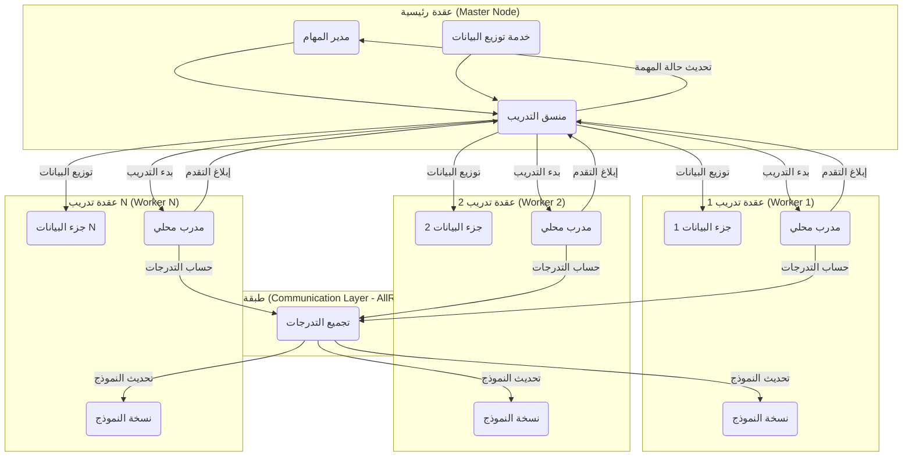

# تصميم بنية التدريب الموزع

## 1. المقدمة

يهدف هذا المستند إلى تصميم بنية تدريب موزع لنظام الذكاء الاصطناعي الزراعي. الهدف الرئيسي هو تقليل وقت تدريب نماذج التعلم العميق المعقدة (مثل نماذج الكشف عن الأمراض أو تحليل الصور) من خلال توزيع عبء العمل على خوادم متعددة (عقد تدريب).

## 2. الأهداف

*   **تقليل وقت التدريب**: تسريع عملية تدريب النماذج بشكل كبير.
*   **قابلية التوسع**: السماح بإضافة المزيد من عقد التدريب لزيادة سرعة التدريب أو تدريب نماذج أكبر.
*   **المرونة**: دعم استراتيجيات توزيع مختلفة (توازي البيانات، توازي النماذج).
*   **التكامل**: سهولة التكامل مع البنية الحالية للنظام.

## 3. النهج المقترح: توازي البيانات (Data Parallelism)

نظراً لطبيعة المهام (تصنيف الصور، الكشف)، يعتبر **توازي البيانات** النهج الأكثر شيوعاً وملاءمة. في هذا النهج:

1.  **تكرار النموذج**: يتم نسخ النموذج بالكامل على كل عقدة تدريب (Worker).
2.  **تقسيم البيانات**: يتم تقسيم مجموعة بيانات التدريب الكبيرة إلى أجزاء أصغر (Shards)، ويتم إرسال جزء مختلف إلى كل عقدة تدريب.
3.  **التدريب المتوازي**: تقوم كل عقدة بتدريب نسختها من النموذج على جزء البيانات الخاص بها بشكل متوازٍ.
4.  **تجميع التدرجات (Gradients)**: بعد كل خطوة تدريب (أو عدة خطوات)، يتم حساب التدرجات (Gradients) على كل عقدة.
5.  **مزامنة التدرجات**: يتم تجميع التدرجات من جميع العقد (عادةً عن طريق حساب المتوسط) باستخدام خادم معلمات (Parameter Server) أو تقنيات الاتصال الجماعي (Collective Communication) مثل All-Reduce.
6.  **تحديث النموذج**: يتم تحديث معلمات النموذج على جميع العقد باستخدام التدرجات المجمعة.

## 4. الأطر والمكتبات المقترحة

*   **PyTorch Distributed**: يوفر واجهات برمجة تطبيقات قوية ومرنة لتنفيذ التدريب الموزع باستخدام PyTorch. يدعم كلاً من خادم المعلمات والاتصال الجماعي (عبر `torch.distributed.rpc` و `torch.distributed`).
*   **Horovod**: إطار عمل مفتوح المصدر للتدريب الموزع يعمل مع TensorFlow و Keras و PyTorch و MXNet. يبسط عملية التدريب الموزع باستخدام عمليات All-Reduce المحسنة.

**الاختيار المبدئي**: **PyTorch Distributed** نظراً لتكامله العميق مع PyTorch (المستخدم في وحدات تحليل الصور) ومرونته.

## 5. بنية النظام

**المكونات الرئيسية:**

*   **العقدة الرئيسية (Master Node)**:
    *   **مدير المهام (Task Manager)**: لإدارة مهام التدريب وتتبع حالتها.
    *   **خدمة توزيع البيانات (Data Distribution Service)**: مسؤولة عن تقسيم مجموعة البيانات وتوزيعها على عقد التدريب.
    *   **منسق التدريب (Training Coordinator)**: يبدأ عملية التدريب على العقد، يراقب التقدم، ويتعامل مع حالات الفشل.
*   **عقد التدريب (Worker Nodes)**:
    *   **نسخة النموذج (Model Replica)**: نسخة كاملة من النموذج المراد تدريبه.
    *   **جزء البيانات (Data Shard)**: جزء من مجموعة بيانات التدريب المخصصة لهذه العقدة.
    *   **المدرب المحلي (Local Trainer)**: يقوم بعملية التدريب الفعلية على البيانات المحلية وحساب التدرجات.
*   **طبقة الاتصال (Communication Layer)**:
    *   تستخدم بروتوكولات مثل `gloo` أو `nccl` (لـ GPUs) لتجميع التدرجات بكفاءة باستخدام عمليات مثل All-Reduce.

## 6. توزيع البيانات

*   يمكن تخزين مجموعة البيانات الكاملة في موقع مركزي (مثل مخزن كائنات سحابي أو نظام ملفات مشترك) يمكن الوصول إليه من جميع العقد.
*   تقوم خدمة توزيع البيانات بتحديد الأجزاء المخصصة لكل عقدة (على سبيل المثال، عن طريق تقسيم فهارس البيانات).
*   تقوم كل عقدة بتحميل جزء البيانات الخاص بها مباشرة من الموقع المركزي.

## 7. مزامنة النموذج

*   **البداية**: يتم تهيئة النموذج بنفس الأوزان الأولية على جميع العقد.
*   **أثناء التدريب**: يتم استخدام عملية All-Reduce لمزامنة التدرجات بعد كل خطوة. تقوم هذه العملية بحساب متوسط التدرجات من جميع العقد وتوزيع المتوسط الناتج مرة أخرى إلى جميع العقد لتحديث نماذجها بشكل متسق.

## 8. إدارة التكوين

*   سيتم استخدام ملفات تكوين (مثل YAML) لتحديد إعدادات التدريب الموزع، بما في ذلك:
    *   عناوين وأدوار العقد (رئيسية، عاملة).
    *   بروتوكول الاتصال الخلفي (backend).
    *   إعدادات تقسيم البيانات.
    *   معلمات التدريب (حجم الدفعة لكل عقدة، معدل التعلم، إلخ).
*   يمكن استخدام أدوات مثل `torchrun` (المعروف سابقًا باسم `torch.distributed.launch`) لتشغيل سكربتات التدريب على العقد المختلفة مع التكوين المناسب.

## 9. التعامل مع الفشل (Fault Tolerance)

*   التدريب الموزع يمكن أن يكون عرضة لفشل العقد.
*   **الحلول الممكنة**:
    *   **نقاط الحفظ الدورية (Checkpointing)**: حفظ حالة النموذج والمُحسِّن (optimizer) بشكل دوري على العقدة الرئيسية أو مخزن مشترك. في حالة فشل عقدة، يمكن إعادة تشغيل التدريب من آخر نقطة حفظ.
    *   **مجموعات العمل المرنة (Elastic Training)**: استخدام أطر تدعم إضافة أو إزالة العقد ديناميكيًا أثناء التدريب (مثل TorchElastic).

## 10. التكامل مع النظام الحالي

*   سيتم تعديل وحدة `continuous_learning.learning_manager` لدعم بدء وإدارة مهام التدريب الموزع.
*   سيتم استدعاء منسق التدريب (Training Coordinator) لبدء عملية التدريب الموزع.
*   سيتم تحديث مدير المهام (Task Manager) لتتبع حالة مهام التدريب الموزع.

## 11. الاعتبارات الأمنية

*   يجب تأمين الاتصال بين العقد، خاصة إذا كانت تعمل في بيئات غير موثوقة.
*   يمكن استخدام TLS/SSL لتشفير الاتصالات.
*   يجب التحكم في الوصول إلى بيانات التدريب الحساسة.

## 12. الخطوات التالية

1.  **تنفيذ منسق التدريب**: تطوير الوحدة المسؤولة عن إدارة عملية التدريب الموزع.
2.  **تعديل سكربتات التدريب**: تكييف سكربتات تدريب النماذج الحالية لاستخدام `torch.distributed`.
3.  **إعداد بيئة الاختبار**: إعداد بيئة متعددة العقد (يمكن استخدام حاويات Docker أو آلات افتراضية للاختبار الأولي) لاختبار البنية.
4.  **الاختبار والتحسين**: اختبار أداء التدريب الموزع وتحسينه.
