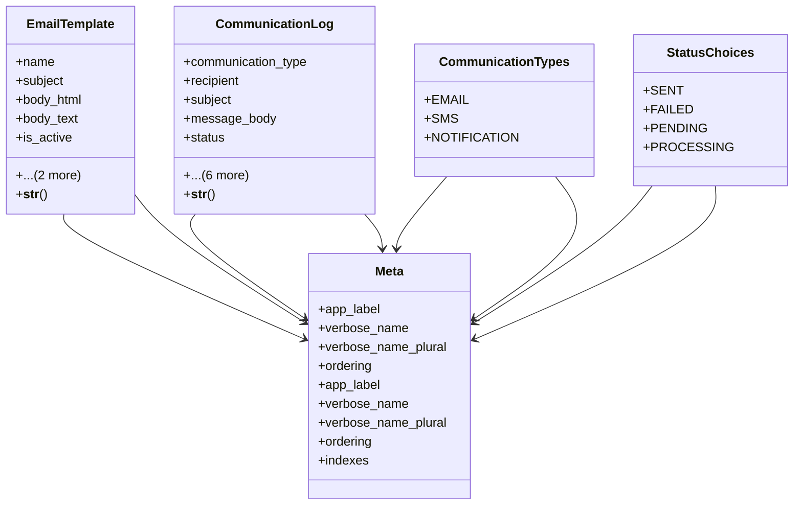

# admin_modules.communication.models

## Imports
- django.contrib.contenttypes.fields
- django.contrib.contenttypes.models
- django.db
- django.utils.translation

## Classes
- EmailTemplate
  - attr: `name`
  - attr: `subject`
  - attr: `body_html`
  - attr: `body_text`
  - attr: `is_active`
  - attr: `created_at`
  - attr: `updated_at`
  - method: `__str__`
- CommunicationLog
  - attr: `communication_type`
  - attr: `recipient`
  - attr: `subject`
  - attr: `message_body`
  - attr: `status`
  - attr: `sent_at`
  - attr: `related_object_type`
  - attr: `related_object_id`
  - attr: `related_object`
  - attr: `error_message`
  - attr: `created_at`
  - method: `__str__`
- Meta
  - attr: `app_label`
  - attr: `verbose_name`
  - attr: `verbose_name_plural`
  - attr: `ordering`
- CommunicationTypes
  - attr: `EMAIL`
  - attr: `SMS`
  - attr: `NOTIFICATION`
- StatusChoices
  - attr: `SENT`
  - attr: `FAILED`
  - attr: `PENDING`
  - attr: `PROCESSING`
- Meta
  - attr: `app_label`
  - attr: `verbose_name`
  - attr: `verbose_name_plural`
  - attr: `ordering`
  - attr: `indexes`

## Functions
- __str__
- __str__

## Class Diagram

