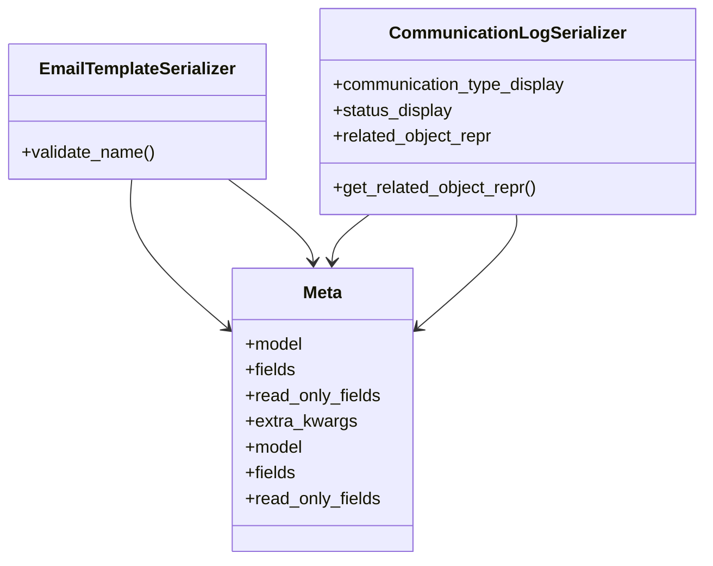

# admin_modules.communication.serializers

## Imports
- django.utils.translation
- models
- rest_framework

## Classes
- EmailTemplateSerializer
  - method: `validate_name`
- CommunicationLogSerializer
  - attr: `communication_type_display`
  - attr: `status_display`
  - attr: `related_object_repr`
  - method: `get_related_object_repr`
- Meta
  - attr: `model`
  - attr: `fields`
  - attr: `read_only_fields`
  - attr: `extra_kwargs`
- Meta
  - attr: `model`
  - attr: `fields`
  - attr: `read_only_fields`

## Functions
- validate_name
- get_related_object_repr

## Class Diagram

