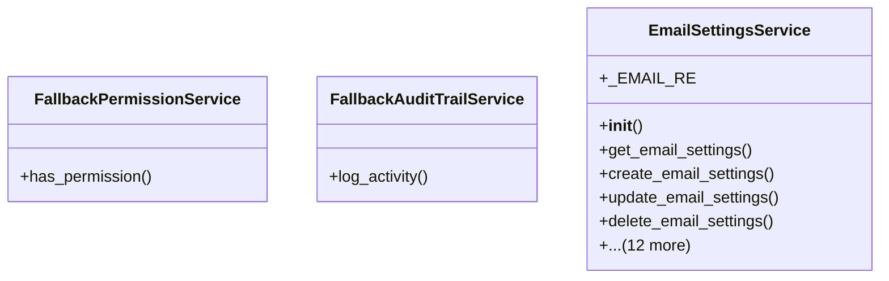

# admin_modules.communication.services.email_service

## Imports
- core_modules.activity_log.services.audit_trail_service
- core_modules.permissions.services.permission_service
- datetime
- logging
- re
- typing

## Classes
- FallbackPermissionService
  - method: `has_permission`
- FallbackAuditTrailService
  - method: `log_activity`
- EmailSettingsService
  - attr: `_EMAIL_RE`
  - method: `__init__`
  - method: `get_email_settings`
  - method: `create_email_settings`
  - method: `update_email_settings`
  - method: `delete_email_settings`
  - method: `set_default_settings`
  - method: `test_email_settings`
  - method: `_require_permission`
  - method: `_now_iso`
  - method: `_generate_new_id`
  - method: `_safe_user_identifier`
  - method: `_mask_value`
  - method: `_sanitize_settings_for_read`
  - method: `_get_email_settings_by_id`
  - method: `_get_all_email_settings`
  - method: `_validate_email_settings`
  - method: `_send_test_email`

## Functions
- has_permission
- log_activity
- __init__
- get_email_settings
- create_email_settings
- update_email_settings
- delete_email_settings
- set_default_settings
- test_email_settings
- _require_permission
- _now_iso
- _generate_new_id
- _safe_user_identifier
- _mask_value
- _sanitize_settings_for_read
- _get_email_settings_by_id
- _get_all_email_settings
- _validate_email_settings
- _send_test_email

## Module Variables
- `logger`
- `PermissionServiceClass`
- `AuditTrailServiceClass`

## Class Diagram

