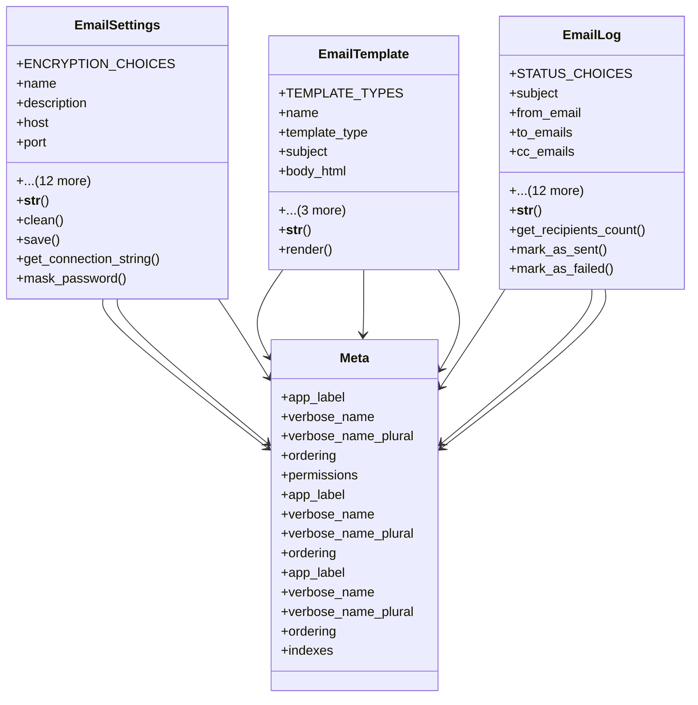

# admin_modules.communication.services.email_settings

## Imports
- core_modules.core.models
- django.contrib.auth
- django.core.exceptions
- django.db
- django.utils
- django.utils.translation

## Classes
- EmailSettings
  - attr: `ENCRYPTION_CHOICES`
  - attr: `name`
  - attr: `description`
  - attr: `host`
  - attr: `port`
  - attr: `encryption`
  - attr: `username`
  - attr: `password`
  - attr: `from_email`
  - attr: `from_name`
  - attr: `timeout`
  - attr: `max_connections`
  - attr: `is_default`
  - attr: `is_active`
  - attr: `last_test_date`
  - attr: `last_test_success`
  - attr: `last_test_message`
  - method: `__str__`
  - method: `clean`
  - method: `save`
  - method: `get_connection_string`
  - method: `mask_password`
- EmailTemplate
  - attr: `TEMPLATE_TYPES`
  - attr: `name`
  - attr: `template_type`
  - attr: `subject`
  - attr: `body_html`
  - attr: `body_text`
  - attr: `variables`
  - attr: `is_active`
  - method: `__str__`
  - method: `render`
- EmailLog
  - attr: `STATUS_CHOICES`
  - attr: `subject`
  - attr: `from_email`
  - attr: `to_emails`
  - attr: `cc_emails`
  - attr: `bcc_emails`
  - attr: `body_html`
  - attr: `body_text`
  - attr: `attachments`
  - attr: `email_settings`
  - attr: `template`
  - attr: `status`
  - attr: `sent_at`
  - attr: `error_message`
  - attr: `retry_count`
  - attr: `sent_by`
  - attr: `metadata`
  - method: `__str__`
  - method: `get_recipients_count`
  - method: `mark_as_sent`
  - method: `mark_as_failed`
- Meta
  - attr: `app_label`
  - attr: `verbose_name`
  - attr: `verbose_name_plural`
  - attr: `ordering`
  - attr: `permissions`
- Meta
  - attr: `app_label`
  - attr: `verbose_name`
  - attr: `verbose_name_plural`
  - attr: `ordering`
- Meta
  - attr: `app_label`
  - attr: `verbose_name`
  - attr: `verbose_name_plural`
  - attr: `ordering`
  - attr: `indexes`

## Functions
- __str__
- clean
- save
- get_connection_string
- mask_password
- __str__
- render
- __str__
- get_recipients_count
- mark_as_sent
- mark_as_failed

## Module Variables
- `User`

## Class Diagram

