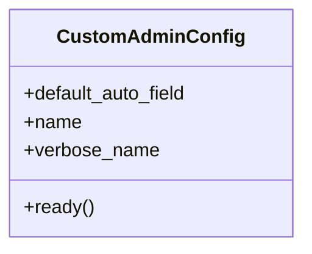

# admin_modules.custom_admin.apps

## Imports
- django.apps

## Classes
- CustomAdminConfig
  - attr: `default_auto_field`
  - attr: `name`
  - attr: `verbose_name`
  - method: `ready`

## Functions
- ready

## Class Diagram

