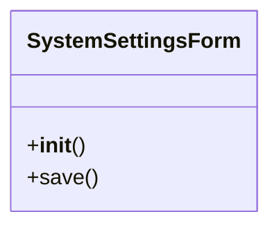

# admin_modules.custom_admin.forms

## Imports
- django
- django.utils.translation

## Classes
- SystemSettingsForm
  - method: `__init__`
  - method: `save`

## Functions
- __init__
- save

## Class Diagram

