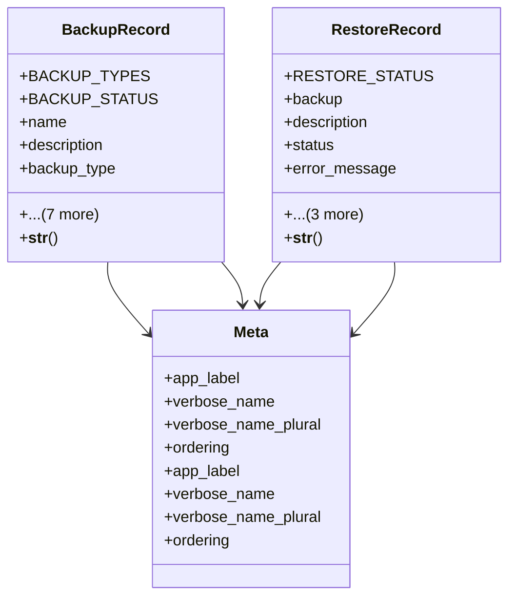

# admin_modules.custom_admin.models.backup_restore

## Imports
- django.contrib.auth
- django.db
- django.utils.translation

## Classes
- BackupRecord
  - attr: `BACKUP_TYPES`
  - attr: `BACKUP_STATUS`
  - attr: `name`
  - attr: `description`
  - attr: `backup_type`
  - attr: `file_path`
  - attr: `file_size`
  - attr: `status`
  - attr: `error_message`
  - attr: `created_by`
  - attr: `created_at`
  - attr: `completed_at`
  - method: `__str__`
- RestoreRecord
  - attr: `RESTORE_STATUS`
  - attr: `backup`
  - attr: `description`
  - attr: `status`
  - attr: `error_message`
  - attr: `created_by`
  - attr: `created_at`
  - attr: `completed_at`
  - method: `__str__`
- Meta
  - attr: `app_label`
  - attr: `verbose_name`
  - attr: `verbose_name_plural`
  - attr: `ordering`
- Meta
  - attr: `app_label`
  - attr: `verbose_name`
  - attr: `verbose_name_plural`
  - attr: `ordering`

## Functions
- __str__
- __str__

## Module Variables
- `User`

## Class Diagram

