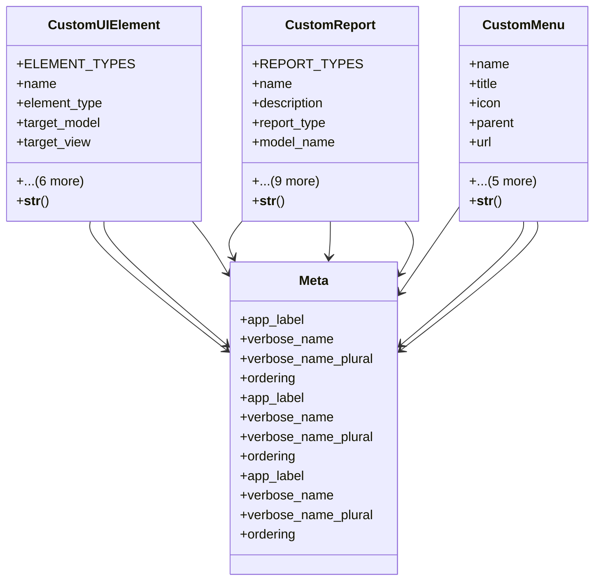

# admin_modules.custom_admin.models.customization

## Imports
- django.contrib.auth
- django.db
- django.utils.translation

## Classes
- CustomUIElement
  - attr: `ELEMENT_TYPES`
  - attr: `name`
  - attr: `element_type`
  - attr: `target_model`
  - attr: `target_view`
  - attr: `position`
  - attr: `config`
  - attr: `is_active`
  - attr: `created_by`
  - attr: `created_at`
  - attr: `updated_at`
  - method: `__str__`
- CustomReport
  - attr: `REPORT_TYPES`
  - attr: `name`
  - attr: `description`
  - attr: `report_type`
  - attr: `model_name`
  - attr: `fields`
  - attr: `filters`
  - attr: `grouping`
  - attr: `sorting`
  - attr: `chart_config`
  - attr: `is_public`
  - attr: `created_by`
  - attr: `created_at`
  - attr: `updated_at`
  - method: `__str__`
- CustomMenu
  - attr: `name`
  - attr: `title`
  - attr: `icon`
  - attr: `parent`
  - attr: `url`
  - attr: `order`
  - attr: `is_active`
  - attr: `created_by`
  - attr: `created_at`
  - attr: `updated_at`
  - method: `__str__`
- Meta
  - attr: `app_label`
  - attr: `verbose_name`
  - attr: `verbose_name_plural`
  - attr: `ordering`
- Meta
  - attr: `app_label`
  - attr: `verbose_name`
  - attr: `verbose_name_plural`
  - attr: `ordering`
- Meta
  - attr: `app_label`
  - attr: `verbose_name`
  - attr: `verbose_name_plural`
  - attr: `ordering`

## Functions
- __str__
- __str__
- __str__

## Module Variables
- `User`

## Class Diagram

