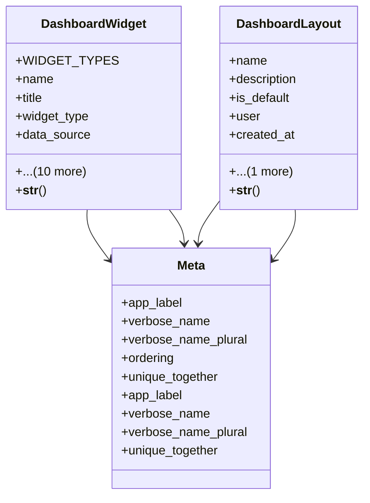

# admin_modules.custom_admin.models.dashboard

## Imports
- django.contrib.auth
- django.db
- django.utils.translation

## Classes
- DashboardWidget
  - attr: `WIDGET_TYPES`
  - attr: `name`
  - attr: `title`
  - attr: `widget_type`
  - attr: `data_source`
  - attr: `refresh_interval`
  - attr: `position_x`
  - attr: `position_y`
  - attr: `width`
  - attr: `height`
  - attr: `is_visible`
  - attr: `config`
  - attr: `user`
  - attr: `created_at`
  - attr: `updated_at`
  - method: `__str__`
- DashboardLayout
  - attr: `name`
  - attr: `description`
  - attr: `is_default`
  - attr: `user`
  - attr: `created_at`
  - attr: `updated_at`
  - method: `__str__`
- Meta
  - attr: `app_label`
  - attr: `verbose_name`
  - attr: `verbose_name_plural`
  - attr: `ordering`
  - attr: `unique_together`
- Meta
  - attr: `app_label`
  - attr: `verbose_name`
  - attr: `verbose_name_plural`
  - attr: `unique_together`

## Functions
- __str__
- __str__

## Module Variables
- `User`

## Class Diagram

