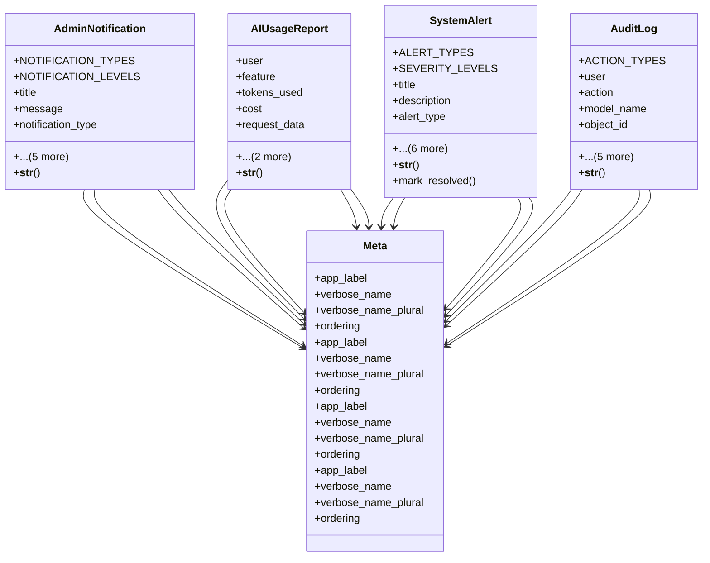

# admin_modules.custom_admin.models.notifications

## Imports
- decimal
- django.contrib.auth
- django.db
- django.utils
- django.utils.translation

## Classes
- AdminNotification
  - attr: `NOTIFICATION_TYPES`
  - attr: `NOTIFICATION_LEVELS`
  - attr: `title`
  - attr: `message`
  - attr: `notification_type`
  - attr: `level`
  - attr: `link`
  - attr: `is_read`
  - attr: `user`
  - attr: `created_at`
  - method: `__str__`
- AIUsageReport
  - attr: `user`
  - attr: `feature`
  - attr: `tokens_used`
  - attr: `cost`
  - attr: `request_data`
  - attr: `response_data`
  - attr: `created_at`
  - method: `__str__`
- SystemAlert
  - attr: `ALERT_TYPES`
  - attr: `SEVERITY_LEVELS`
  - attr: `title`
  - attr: `description`
  - attr: `alert_type`
  - attr: `severity`
  - attr: `is_resolved`
  - attr: `resolved_by`
  - attr: `resolved_at`
  - attr: `metadata`
  - attr: `created_at`
  - method: `__str__`
  - method: `mark_resolved`
- AuditLog
  - attr: `ACTION_TYPES`
  - attr: `user`
  - attr: `action`
  - attr: `model_name`
  - attr: `object_id`
  - attr: `object_repr`
  - attr: `changes`
  - attr: `ip_address`
  - attr: `user_agent`
  - attr: `created_at`
  - method: `__str__`
- Meta
  - attr: `app_label`
  - attr: `verbose_name`
  - attr: `verbose_name_plural`
  - attr: `ordering`
- Meta
  - attr: `app_label`
  - attr: `verbose_name`
  - attr: `verbose_name_plural`
  - attr: `ordering`
- Meta
  - attr: `app_label`
  - attr: `verbose_name`
  - attr: `verbose_name_plural`
  - attr: `ordering`
- Meta
  - attr: `app_label`
  - attr: `verbose_name`
  - attr: `verbose_name_plural`
  - attr: `ordering`

## Functions
- __str__
- __str__
- __str__
- mark_resolved
- __str__

## Module Variables
- `User`

## Class Diagram

