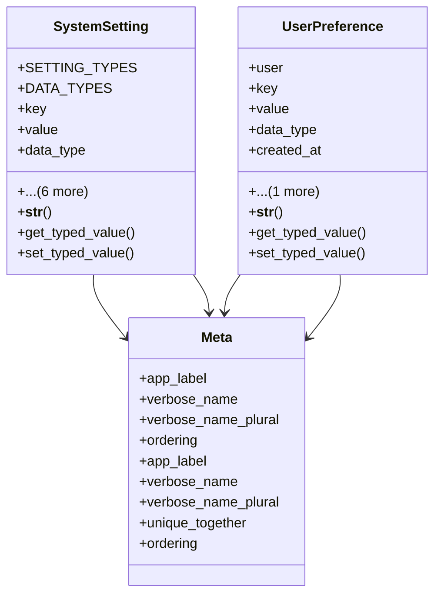

# admin_modules.custom_admin.models.system_settings

## Imports
- datetime
- django.contrib.auth
- django.db
- django.utils.translation
- json

## Classes
- SystemSetting
  - attr: `SETTING_TYPES`
  - attr: `DATA_TYPES`
  - attr: `key`
  - attr: `value`
  - attr: `data_type`
  - attr: `setting_type`
  - attr: `description`
  - attr: `is_active`
  - attr: `created_by`
  - attr: `created_at`
  - attr: `updated_at`
  - method: `__str__`
  - method: `get_typed_value`
  - method: `set_typed_value`
- UserPreference
  - attr: `user`
  - attr: `key`
  - attr: `value`
  - attr: `data_type`
  - attr: `created_at`
  - attr: `updated_at`
  - method: `__str__`
  - method: `get_typed_value`
  - method: `set_typed_value`
- Meta
  - attr: `app_label`
  - attr: `verbose_name`
  - attr: `verbose_name_plural`
  - attr: `ordering`
- Meta
  - attr: `app_label`
  - attr: `verbose_name`
  - attr: `verbose_name_plural`
  - attr: `unique_together`
  - attr: `ordering`

## Functions
- __str__
- get_typed_value
- set_typed_value
- __str__
- get_typed_value
- set_typed_value

## Module Variables
- `User`

## Class Diagram

