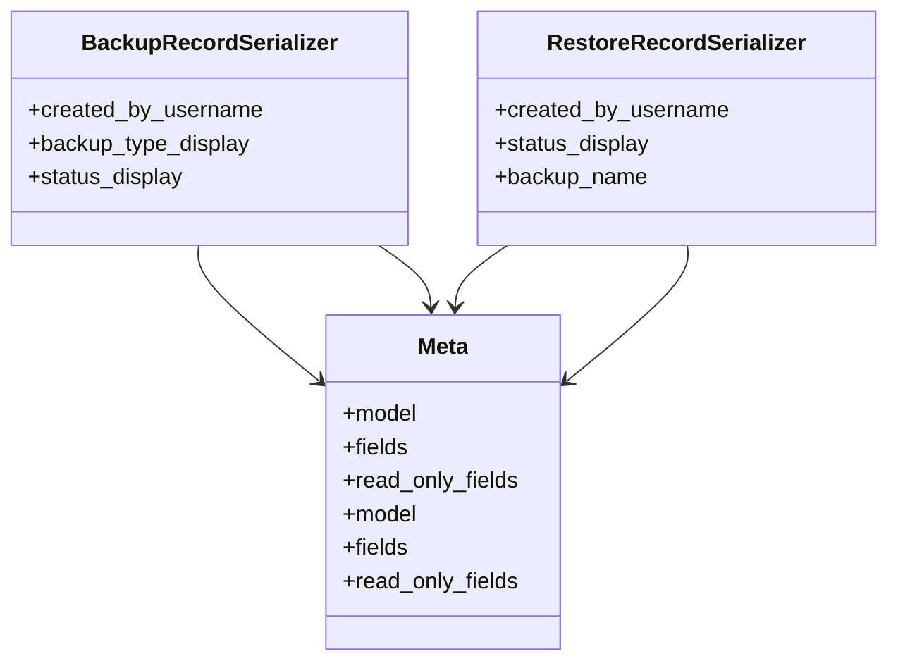

# admin_modules.custom_admin.serializers.backup_restore_serializers

## Imports
- models.backup_restore
- rest_framework

## Classes
- BackupRecordSerializer
  - attr: `created_by_username`
  - attr: `backup_type_display`
  - attr: `status_display`
- RestoreRecordSerializer
  - attr: `created_by_username`
  - attr: `status_display`
  - attr: `backup_name`
- Meta
  - attr: `model`
  - attr: `fields`
  - attr: `read_only_fields`
- Meta
  - attr: `model`
  - attr: `fields`
  - attr: `read_only_fields`

## Class Diagram

