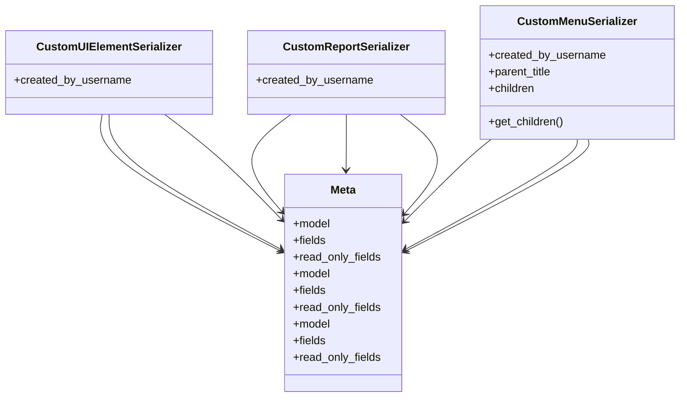

# admin_modules.custom_admin.serializers.customization_serializers

## Imports
- models
- rest_framework

## Classes
- CustomUIElementSerializer
  - attr: `created_by_username`
- CustomReportSerializer
  - attr: `created_by_username`
- CustomMenuSerializer
  - attr: `created_by_username`
  - attr: `parent_title`
  - attr: `children`
  - method: `get_children`
- Meta
  - attr: `model`
  - attr: `fields`
  - attr: `read_only_fields`
- Meta
  - attr: `model`
  - attr: `fields`
  - attr: `read_only_fields`
- Meta
  - attr: `model`
  - attr: `fields`
  - attr: `read_only_fields`

## Functions
- get_children

## Class Diagram

