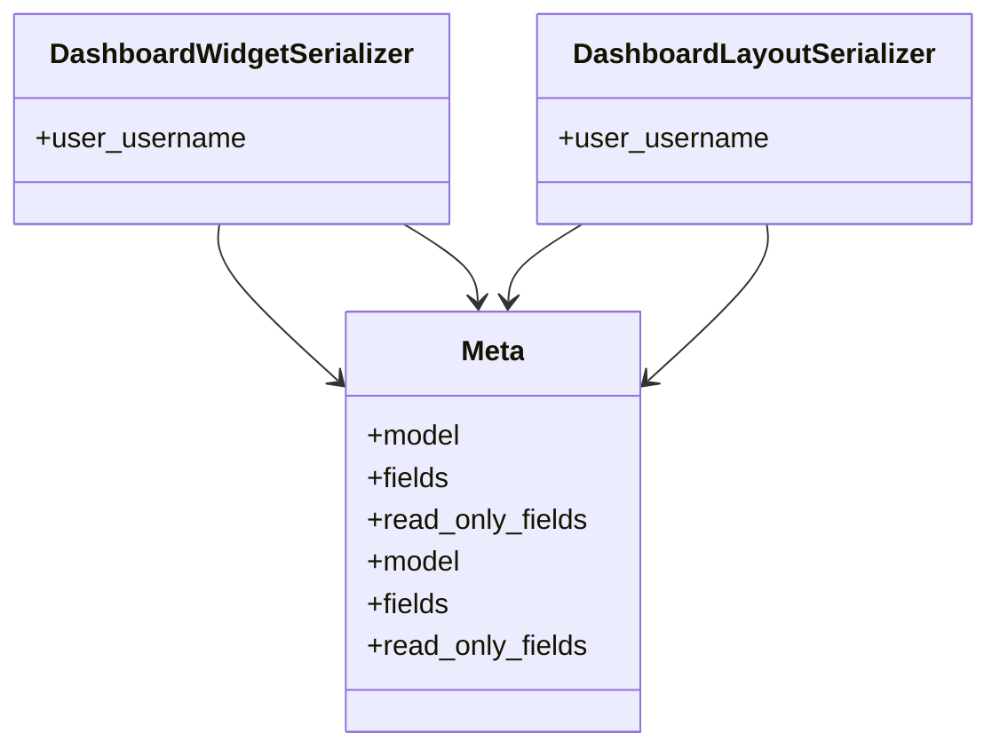

# admin_modules.custom_admin.serializers.dashboard_serializers

## Imports
- models
- rest_framework

## Classes
- DashboardWidgetSerializer
  - attr: `user_username`
- DashboardLayoutSerializer
  - attr: `user_username`
- Meta
  - attr: `model`
  - attr: `fields`
  - attr: `read_only_fields`
- Meta
  - attr: `model`
  - attr: `fields`
  - attr: `read_only_fields`

## Class Diagram

