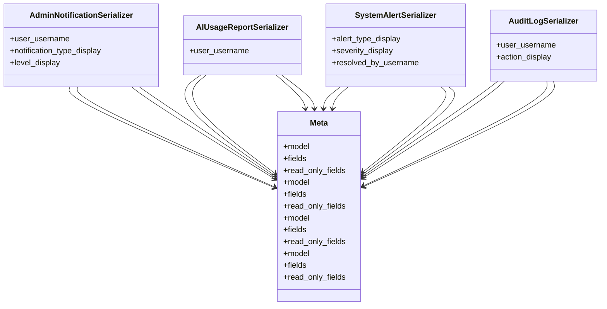

# admin_modules.custom_admin.serializers.notifications_serializers

## Imports
- models
- rest_framework

## Classes
- AdminNotificationSerializer
  - attr: `user_username`
  - attr: `notification_type_display`
  - attr: `level_display`
- AIUsageReportSerializer
  - attr: `user_username`
- SystemAlertSerializer
  - attr: `alert_type_display`
  - attr: `severity_display`
  - attr: `resolved_by_username`
- AuditLogSerializer
  - attr: `user_username`
  - attr: `action_display`
- Meta
  - attr: `model`
  - attr: `fields`
  - attr: `read_only_fields`
- Meta
  - attr: `model`
  - attr: `fields`
  - attr: `read_only_fields`
- Meta
  - attr: `model`
  - attr: `fields`
  - attr: `read_only_fields`
- Meta
  - attr: `model`
  - attr: `fields`
  - attr: `read_only_fields`

## Class Diagram

