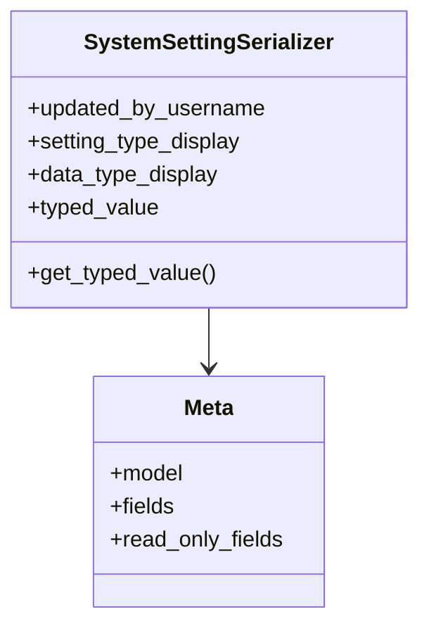

# admin_modules.custom_admin.serializers.system_settings_serializers

## Imports
- models.system_settings
- rest_framework

## Classes
- SystemSettingSerializer
  - attr: `updated_by_username`
  - attr: `setting_type_display`
  - attr: `data_type_display`
  - attr: `typed_value`
  - method: `get_typed_value`
- Meta
  - attr: `model`
  - attr: `fields`
  - attr: `read_only_fields`

## Functions
- get_typed_value

## Class Diagram

