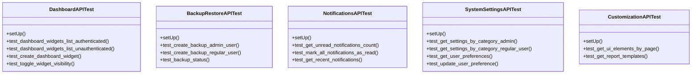

# admin_modules.custom_admin.tests.test_api

## Imports
- django.contrib.auth
- rest_framework
- rest_framework.test

## Classes
- DashboardAPITest
  - method: `setUp`
  - method: `test_dashboard_widgets_list_authenticated`
  - method: `test_dashboard_widgets_list_unauthenticated`
  - method: `test_create_dashboard_widget`
  - method: `test_toggle_widget_visibility`
- BackupRestoreAPITest
  - method: `setUp`
  - method: `test_create_backup_admin_user`
  - method: `test_create_backup_regular_user`
  - method: `test_backup_status`
- NotificationsAPITest
  - method: `setUp`
  - method: `test_get_unread_notifications_count`
  - method: `test_mark_all_notifications_as_read`
  - method: `test_get_recent_notifications`
- SystemSettingsAPITest
  - method: `setUp`
  - method: `test_get_settings_by_category_admin`
  - method: `test_get_settings_by_category_regular_user`
  - method: `test_get_user_preferences`
  - method: `test_update_user_preference`
- CustomizationAPITest
  - method: `setUp`
  - method: `test_get_ui_elements_by_page`
  - method: `test_get_report_templates`

## Functions
- setUp
- test_dashboard_widgets_list_authenticated
- test_dashboard_widgets_list_unauthenticated
- test_create_dashboard_widget
- test_toggle_widget_visibility
- setUp
- test_create_backup_admin_user
- test_create_backup_regular_user
- test_backup_status
- setUp
- test_get_unread_notifications_count
- test_mark_all_notifications_as_read
- test_get_recent_notifications
- setUp
- test_get_settings_by_category_admin
- test_get_settings_by_category_regular_user
- test_get_user_preferences
- test_update_user_preference
- setUp
- test_get_ui_elements_by_page
- test_get_report_templates

## Module Variables
- `User`

## Class Diagram

