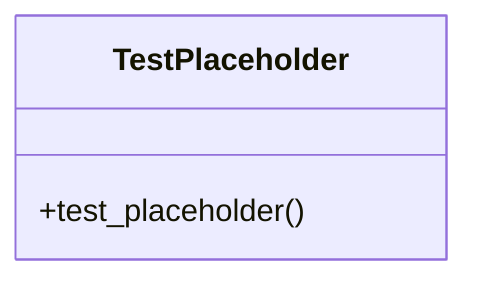

# admin_modules.custom_admin.tests.test_integration

## Imports
- django.test

## Classes
- TestPlaceholder
  - method: `test_placeholder`

## Functions
- test_placeholder

## Class Diagram

```mermaid
classDiagram
    class TestPlaceholder {
        +test_placeholder()
    }
```
