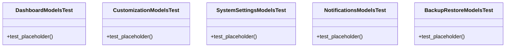

# admin_modules.custom_admin.tests.test_models

## Imports
- django.contrib.auth
- django.test

## Classes
- DashboardModelsTest
  - method: `test_placeholder`
- CustomizationModelsTest
  - method: `test_placeholder`
- SystemSettingsModelsTest
  - method: `test_placeholder`
- NotificationsModelsTest
  - method: `test_placeholder`
- BackupRestoreModelsTest
  - method: `test_placeholder`

## Functions
- test_placeholder
- test_placeholder
- test_placeholder
- test_placeholder
- test_placeholder

## Module Variables
- `User`

## Class Diagram

