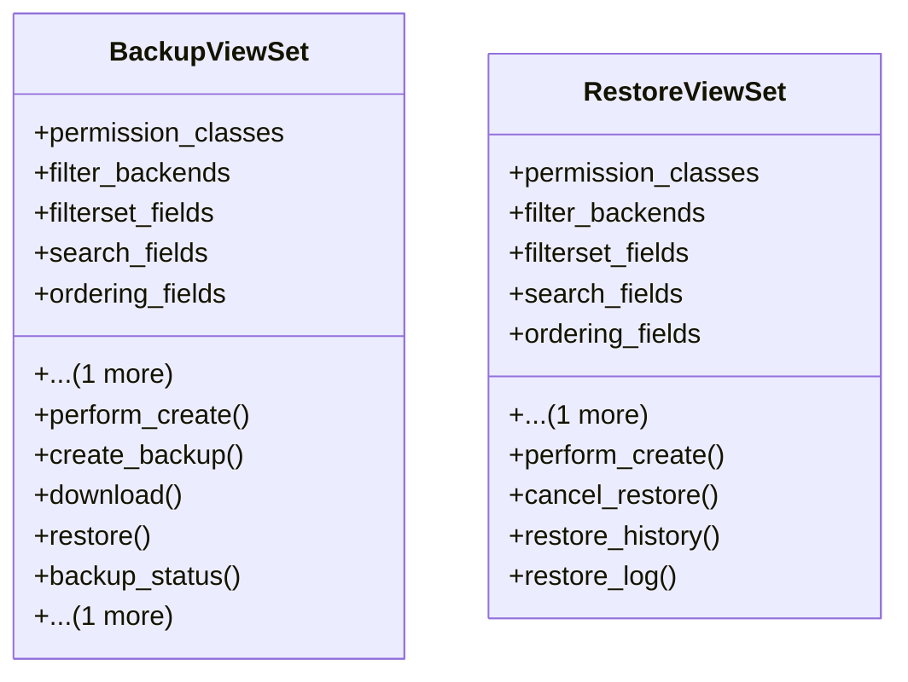

# admin_modules.custom_admin.views.backup_restore_views

## Imports
- datetime
- django.http
- django.utils
- django_filters.rest_framework
- json
- os
- rest_framework
- rest_framework.decorators
- rest_framework.response

## Classes
- BackupViewSet
  - attr: `permission_classes`
  - attr: `filter_backends`
  - attr: `filterset_fields`
  - attr: `search_fields`
  - attr: `ordering_fields`
  - attr: `ordering`
  - method: `perform_create`
  - method: `create_backup`
  - method: `download`
  - method: `restore`
  - method: `backup_status`
  - method: `schedule_backup`
- RestoreViewSet
  - attr: `permission_classes`
  - attr: `filter_backends`
  - attr: `filterset_fields`
  - attr: `search_fields`
  - attr: `ordering_fields`
  - attr: `ordering`
  - method: `perform_create`
  - method: `cancel_restore`
  - method: `restore_history`
  - method: `restore_log`

## Functions
- perform_create
- create_backup
- download
- restore
- backup_status
- schedule_backup
- perform_create
- cancel_restore
- restore_history
- restore_log

## Class Diagram

