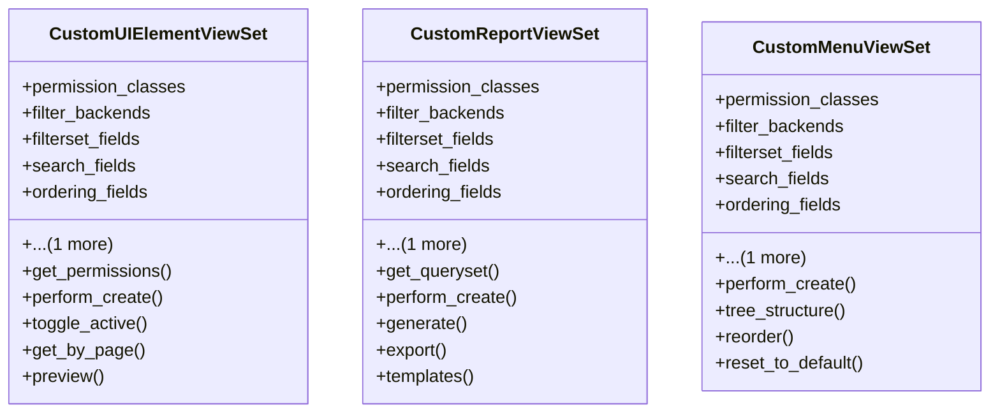

# admin_modules.custom_admin.views.customization_views

## Imports
- django.utils
- django_filters.rest_framework
- json
- rest_framework
- rest_framework.decorators
- rest_framework.response

## Classes
- CustomUIElementViewSet
  - attr: `permission_classes`
  - attr: `filter_backends`
  - attr: `filterset_fields`
  - attr: `search_fields`
  - attr: `ordering_fields`
  - attr: `ordering`
  - method: `get_permissions`
  - method: `perform_create`
  - method: `toggle_active`
  - method: `get_by_page`
  - method: `preview`
- CustomReportViewSet
  - attr: `permission_classes`
  - attr: `filter_backends`
  - attr: `filterset_fields`
  - attr: `search_fields`
  - attr: `ordering_fields`
  - attr: `ordering`
  - method: `get_queryset`
  - method: `perform_create`
  - method: `generate`
  - method: `export`
  - method: `templates`
- CustomMenuViewSet
  - attr: `permission_classes`
  - attr: `filter_backends`
  - attr: `filterset_fields`
  - attr: `search_fields`
  - attr: `ordering_fields`
  - attr: `ordering`
  - method: `perform_create`
  - method: `tree_structure`
  - method: `reorder`
  - method: `reset_to_default`

## Functions
- get_permissions
- perform_create
- toggle_active
- get_by_page
- preview
- get_queryset
- perform_create
- generate
- export
- templates
- perform_create
- tree_structure
- reorder
- reset_to_default

## Class Diagram

