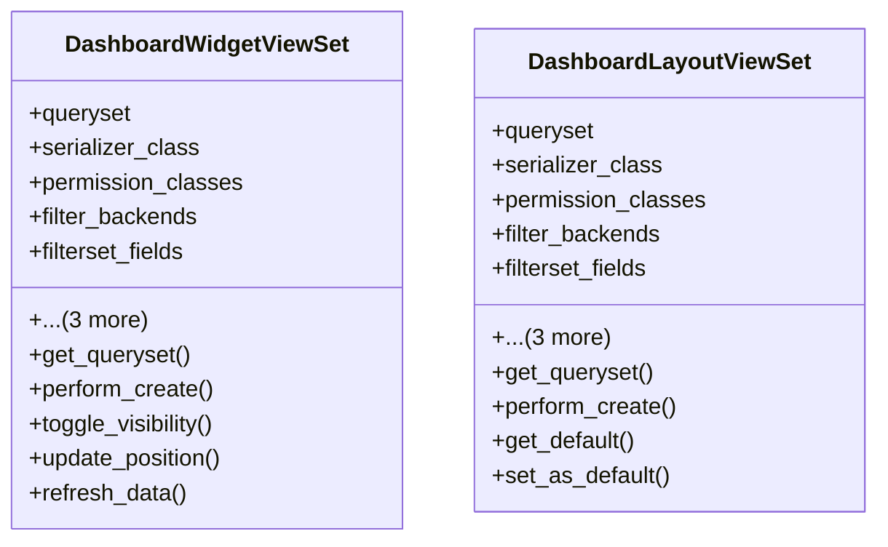

# admin_modules.custom_admin.views.dashboard_views

## Imports
- django_filters.rest_framework
- models.dashboard
- rest_framework
- rest_framework.decorators
- rest_framework.response
- serializers.dashboard_serializers

## Classes
- DashboardWidgetViewSet
  - attr: `queryset`
  - attr: `serializer_class`
  - attr: `permission_classes`
  - attr: `filter_backends`
  - attr: `filterset_fields`
  - attr: `search_fields`
  - attr: `ordering_fields`
  - attr: `ordering`
  - method: `get_queryset`
  - method: `perform_create`
  - method: `toggle_visibility`
  - method: `update_position`
  - method: `refresh_data`
- DashboardLayoutViewSet
  - attr: `queryset`
  - attr: `serializer_class`
  - attr: `permission_classes`
  - attr: `filter_backends`
  - attr: `filterset_fields`
  - attr: `search_fields`
  - attr: `ordering_fields`
  - attr: `ordering`
  - method: `get_queryset`
  - method: `perform_create`
  - method: `get_default`
  - method: `set_as_default`

## Functions
- get_queryset
- perform_create
- toggle_visibility
- update_position
- refresh_data
- get_queryset
- perform_create
- get_default
- set_as_default

## Class Diagram

