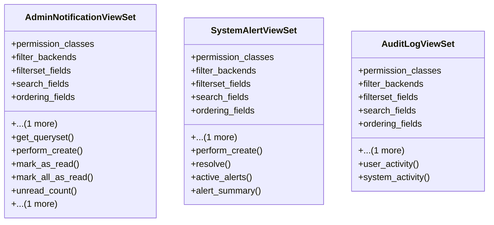

# admin_modules.custom_admin.views.notifications_views

## Imports
- datetime
- django.db.models
- django.utils
- django_filters.rest_framework
- rest_framework
- rest_framework.decorators
- rest_framework.response

## Classes
- AdminNotificationViewSet
  - attr: `permission_classes`
  - attr: `filter_backends`
  - attr: `filterset_fields`
  - attr: `search_fields`
  - attr: `ordering_fields`
  - attr: `ordering`
  - method: `get_queryset`
  - method: `perform_create`
  - method: `mark_as_read`
  - method: `mark_all_as_read`
  - method: `unread_count`
  - method: `recent`
- SystemAlertViewSet
  - attr: `permission_classes`
  - attr: `filter_backends`
  - attr: `filterset_fields`
  - attr: `search_fields`
  - attr: `ordering_fields`
  - attr: `ordering`
  - method: `perform_create`
  - method: `resolve`
  - method: `active_alerts`
  - method: `alert_summary`
- AuditLogViewSet
  - attr: `permission_classes`
  - attr: `filter_backends`
  - attr: `filterset_fields`
  - attr: `search_fields`
  - attr: `ordering_fields`
  - attr: `ordering`
  - method: `user_activity`
  - method: `system_activity`

## Functions
- get_queryset
- perform_create
- mark_as_read
- mark_all_as_read
- unread_count
- recent
- perform_create
- resolve
- active_alerts
- alert_summary
- user_activity
- system_activity

## Class Diagram

