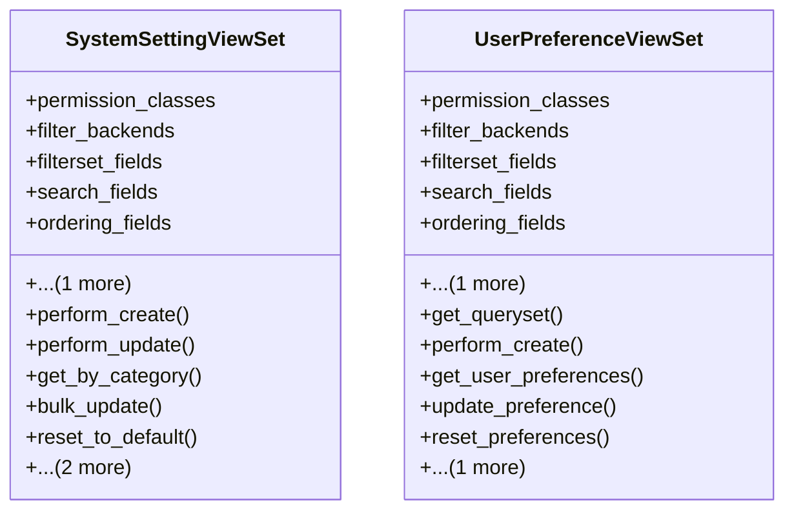

# admin_modules.custom_admin.views.system_settings_views

## Imports
- django.conf
- django.utils
- django_filters.rest_framework
- json
- rest_framework
- rest_framework.decorators
- rest_framework.response

## Classes
- SystemSettingViewSet
  - attr: `permission_classes`
  - attr: `filter_backends`
  - attr: `filterset_fields`
  - attr: `search_fields`
  - attr: `ordering_fields`
  - attr: `ordering`
  - method: `perform_create`
  - method: `perform_update`
  - method: `get_by_category`
  - method: `bulk_update`
  - method: `reset_to_default`
  - method: `export_settings`
  - method: `import_settings`
- UserPreferenceViewSet
  - attr: `permission_classes`
  - attr: `filter_backends`
  - attr: `filterset_fields`
  - attr: `search_fields`
  - attr: `ordering_fields`
  - attr: `ordering`
  - method: `get_queryset`
  - method: `perform_create`
  - method: `get_user_preferences`
  - method: `update_preference`
  - method: `reset_preferences`
  - method: `get_available_options`

## Functions
- perform_create
- perform_update
- get_by_category
- bulk_update
- reset_to_default
- export_settings
- import_settings
- get_queryset
- perform_create
- get_user_preferences
- update_preference
- reset_preferences
- get_available_options

## Class Diagram

