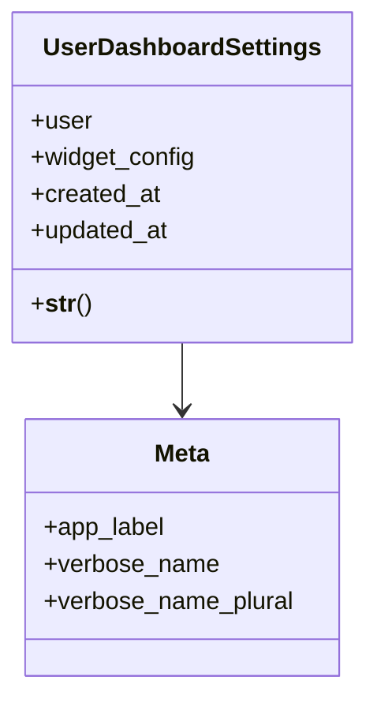

# admin_modules.dashboard.models

## Imports
- django.conf
- django.db
- django.utils.translation

## Classes
- UserDashboardSettings
  - attr: `user`
  - attr: `widget_config`
  - attr: `created_at`
  - attr: `updated_at`
  - method: `__str__`
- Meta
  - attr: `app_label`
  - attr: `verbose_name`
  - attr: `verbose_name_plural`

## Functions
- __str__

## Class Diagram

