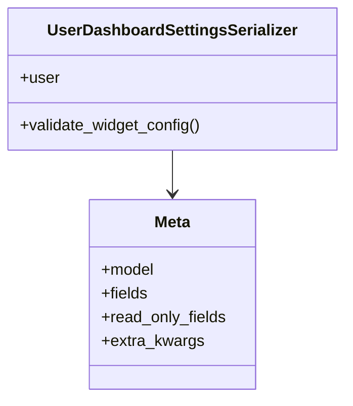

# admin_modules.dashboard.serializers

## Imports
- django.utils.translation
- rest_framework

## Classes
- UserDashboardSettingsSerializer
  - attr: `user`
  - method: `validate_widget_config`
- Meta
  - attr: `model`
  - attr: `fields`
  - attr: `read_only_fields`
  - attr: `extra_kwargs`

## Functions
- validate_widget_config

## Class Diagram

