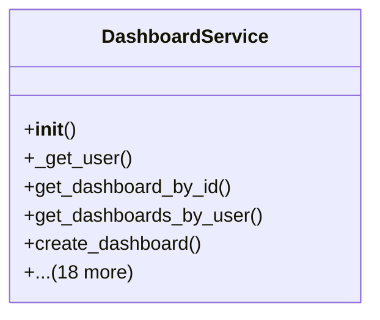

# admin_modules.dashboard.services.dashboard_service

## Imports
- core_modules.activity_log.services.audit_trail_service
- datetime
- django.contrib.auth.models
- django.contrib.sessions.models
- django.db
- django.db.models
- importlib
- logging
- random
- typing

## Classes
- DashboardService
  - method: `__init__`
  - method: `_get_user`
  - method: `get_dashboard_by_id`
  - method: `get_dashboards_by_user`
  - method: `create_dashboard`
  - method: `update_dashboard`
  - method: `delete_dashboard`
  - method: `share_dashboard`
  - method: `get_available_widgets`
  - method: `get_widget_data`
  - method: `_check_dashboard_permissions`
  - method: `_serialize_dashboard`
  - method: `_create_widgets`
  - method: `_update_widgets`
  - method: `_get_widget_data_by_type`
  - method: `_get_stats_widget_data`
  - method: `_get_chart_widget_data`
  - method: `_get_users_stats`
  - method: `_get_tasks_stats`
  - method: `_get_general_stats`
  - method: `_get_sales_chart_data`
  - method: `_get_tasks_chart_data_stub`
  - method: `_get_tasks_widget_data_stub`

## Functions
- __init__
- _get_user
- get_dashboard_by_id
- get_dashboards_by_user
- create_dashboard
- update_dashboard
- delete_dashboard
- share_dashboard
- get_available_widgets
- get_widget_data
- _check_dashboard_permissions
- _serialize_dashboard
- _create_widgets
- _update_widgets
- _get_widget_data_by_type
- _get_stats_widget_data
- _get_chart_widget_data
- _get_users_stats
- _get_tasks_stats
- _get_general_stats
- _get_sales_chart_data
- _get_tasks_chart_data_stub
- _get_tasks_widget_data_stub

## Module Variables
- `Dashboard`
- `DashboardAccess`
- `WidgetType`
- `Widget`
- `Task`
- `logger`

## Class Diagram

