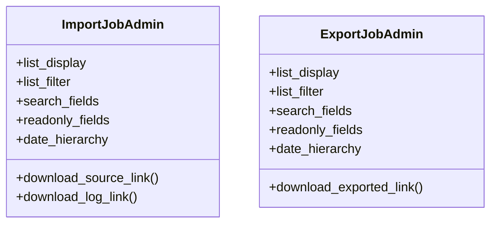

# admin_modules.data_import_export.admin

## Imports
- django.contrib
- django.utils.html
- models

## Classes
- ImportJobAdmin
  - attr: `list_display`
  - attr: `list_filter`
  - attr: `search_fields`
  - attr: `readonly_fields`
  - attr: `date_hierarchy`
  - method: `download_source_link`
  - method: `download_log_link`
- ExportJobAdmin
  - attr: `list_display`
  - attr: `list_filter`
  - attr: `search_fields`
  - attr: `readonly_fields`
  - attr: `date_hierarchy`
  - method: `download_exported_link`

## Functions
- download_source_link
- download_log_link
- download_exported_link

## Class Diagram

