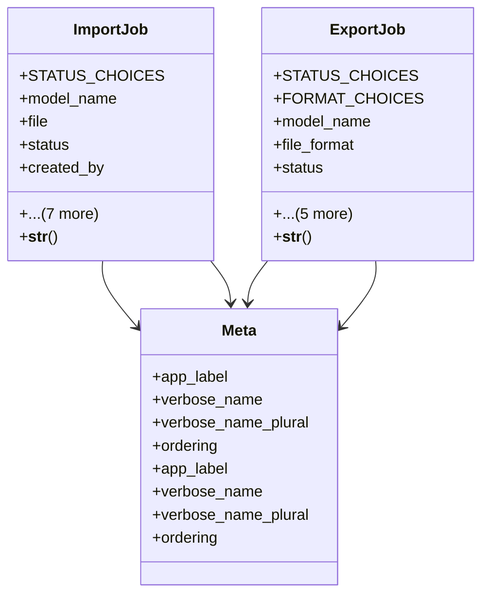

# admin_modules.data_import_export.models

## Imports
- django.conf
- django.db
- django.utils.translation

## Classes
- ImportJob
  - attr: `STATUS_CHOICES`
  - attr: `model_name`
  - attr: `file`
  - attr: `status`
  - attr: `created_by`
  - attr: `created_at`
  - attr: `started_at`
  - attr: `completed_at`
  - attr: `total_rows`
  - attr: `processed_rows`
  - attr: `error_count`
  - attr: `log_file`
  - method: `__str__`
- ExportJob
  - attr: `STATUS_CHOICES`
  - attr: `FORMAT_CHOICES`
  - attr: `model_name`
  - attr: `file_format`
  - attr: `status`
  - attr: `created_by`
  - attr: `created_at`
  - attr: `started_at`
  - attr: `completed_at`
  - attr: `exported_file`
  - method: `__str__`
- Meta
  - attr: `app_label`
  - attr: `verbose_name`
  - attr: `verbose_name_plural`
  - attr: `ordering`
- Meta
  - attr: `app_label`
  - attr: `verbose_name`
  - attr: `verbose_name_plural`
  - attr: `ordering`

## Functions
- __str__
- __str__

## Class Diagram

