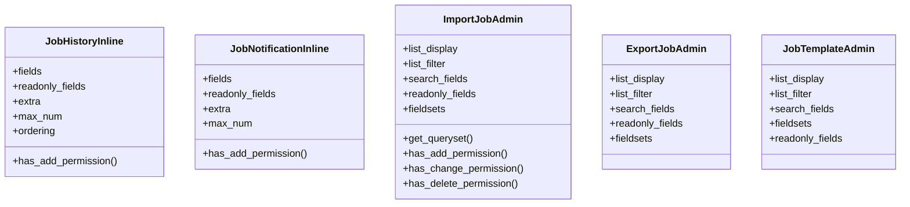

# admin_modules.data_import_export.modles.import_export_admin

## Imports
- datetime
- django.contrib
- django.db
- django.http
- django.shortcuts
- django.urls
- django.utils
- django.utils.html
- django.utils.translation
- os
- rest_framework
- uuid

## Classes
- JobHistoryInline
  - attr: `fields`
  - attr: `readonly_fields`
  - attr: `extra`
  - attr: `max_num`
  - attr: `ordering`
  - method: `has_add_permission`
- JobNotificationInline
  - attr: `fields`
  - attr: `readonly_fields`
  - attr: `extra`
  - attr: `max_num`
  - method: `has_add_permission`
- ImportJobAdmin
  - attr: `list_display`
  - attr: `list_filter`
  - attr: `search_fields`
  - attr: `readonly_fields`
  - attr: `fieldsets`
  - method: `get_queryset`
  - method: `has_add_permission`
  - method: `has_change_permission`
  - method: `has_delete_permission`
- ExportJobAdmin
  - attr: `list_display`
  - attr: `list_filter`
  - attr: `search_fields`
  - attr: `readonly_fields`
  - attr: `fieldsets`
- JobTemplateAdmin
  - attr: `list_display`
  - attr: `list_filter`
  - attr: `search_fields`
  - attr: `fieldsets`
  - attr: `readonly_fields`

## Functions
- has_add_permission
- has_add_permission
- get_queryset
- has_add_permission
- has_change_permission
- has_delete_permission

## Class Diagram

