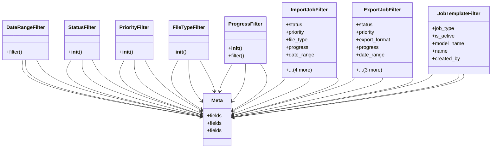

# admin_modules.data_import_export.modles.import_export_filters

## Imports
- datetime
- django
- django.utils
- django_filters

## Classes
- DateRangeFilter
  - method: `filter`
- StatusFilter
  - method: `__init__`
- PriorityFilter
  - method: `__init__`
- FileTypeFilter
  - method: `__init__`
- ProgressFilter
  - method: `__init__`
  - method: `filter`
- ImportJobFilter
  - attr: `status`
  - attr: `priority`
  - attr: `file_type`
  - attr: `progress`
  - attr: `date_range`
  - attr: `created_at`
  - attr: `model_name`
  - attr: `file_name`
  - attr: `created_by`
- ExportJobFilter
  - attr: `status`
  - attr: `priority`
  - attr: `export_format`
  - attr: `progress`
  - attr: `date_range`
  - attr: `created_at`
  - attr: `model_name`
  - attr: `created_by`
- JobTemplateFilter
  - attr: `job_type`
  - attr: `is_active`
  - attr: `model_name`
  - attr: `name`
  - attr: `created_by`
- Meta
  - attr: `fields`
- Meta
  - attr: `fields`
- Meta
  - attr: `fields`

## Functions
- filter
- __init__
- __init__
- __init__
- __init__
- filter

## Class Diagram

