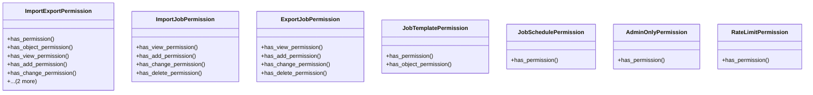

# admin_modules.data_import_export.modles.import_export_permissions

## Imports
- datetime
- django.contrib.auth.models
- django.core.cache
- pytz
- rest_framework

## Classes
- ImportExportPermission
  - method: `has_permission`
  - method: `has_object_permission`
  - method: `has_view_permission`
  - method: `has_add_permission`
  - method: `has_change_permission`
  - method: `has_delete_permission`
  - method: `has_custom_permission`
- ImportJobPermission
  - method: `has_view_permission`
  - method: `has_add_permission`
  - method: `has_change_permission`
  - method: `has_delete_permission`
- ExportJobPermission
  - method: `has_view_permission`
  - method: `has_add_permission`
  - method: `has_change_permission`
  - method: `has_delete_permission`
- JobTemplatePermission
  - method: `has_permission`
  - method: `has_object_permission`
- JobSchedulePermission
  - method: `has_permission`
- AdminOnlyPermission
  - method: `has_permission`
- RateLimitPermission
  - method: `has_permission`

## Functions
- get_user_permissions
- check_file_access_permission
- check_job_ownership
- has_permission
- has_object_permission
- has_view_permission
- has_add_permission
- has_change_permission
- has_delete_permission
- has_custom_permission
- has_view_permission
- has_add_permission
- has_change_permission
- has_delete_permission
- has_view_permission
- has_add_permission
- has_change_permission
- has_delete_permission
- has_permission
- has_object_permission
- has_permission
- has_permission
- has_permission

## Class Diagram

