# admin_modules.data_import_export.modles.import_export_serializers

## Imports
- django.contrib.auth.models
- rest_framework

## Classes
- UserBasicSerializer
- ImportJobSerializer
  - attr: `created_by_username`
  - attr: `status_display`
  - attr: `priority_display`
  - attr: `file_type_display`
  - attr: `import_mode_display`
  - attr: `duration`
  - attr: `progress_percentage`
  - attr: `file_size`
  - method: `get_duration`
  - method: `get_progress_percentage`
  - method: `get_file_size`
- ExportJobSerializer
  - attr: `created_by_username`
  - attr: `status_display`
  - attr: `priority_display`
  - attr: `export_format_display`
  - attr: `duration`
  - attr: `progress_percentage`
  - attr: `result_file_size`
  - method: `get_duration`
  - method: `get_progress_percentage`
  - method: `get_result_file_size`
- JobTemplateSerializer
  - attr: `created_by_username`
  - attr: `job_type_display`
- JobHistorySerializer
  - attr: `user_username`
- JobNotificationSerializer
  - attr: `notification_type_display`
  - attr: `trigger_display`
- JobScheduleSerializer
  - attr: `job_type_display`
  - attr: `frequency_display`
  - attr: `created_by_username`
- ImportJobCreateSerializer
  - method: `validate_file`
- ExportJobCreateSerializer
  - method: `validate_fields_to_export`
- JobProgressSerializer
  - attr: `job_id`
  - attr: `status`
  - attr: `progress`
  - attr: `total_records`
  - attr: `processed_records`
  - attr: `success_records`
  - attr: `error_records`
  - attr: `error_details`
  - attr: `estimated_time_remaining`
- JobStatsSerializer
  - attr: `total_jobs`
  - attr: `pending_jobs`
  - attr: `running_jobs`
  - attr: `completed_jobs`
  - attr: `failed_jobs`
  - attr: `success_rate`
  - attr: `average_duration`
  - attr: `total_records_processed`
  - attr: `total_file_size`
- Meta
  - attr: `model`
  - attr: `fields`
  - attr: `read_only_fields`
- Meta
  - attr: `fields`
  - attr: `read_only_fields`
- Meta
  - attr: `fields`
  - attr: `read_only_fields`
- Meta
  - attr: `fields`
  - attr: `read_only_fields`
- Meta
  - attr: `fields`
  - attr: `read_only_fields`
- Meta
  - attr: `fields`
  - attr: `read_only_fields`
- Meta
  - attr: `fields`
  - attr: `read_only_fields`
- Meta
  - attr: `fields`
- Meta
  - attr: `fields`

## Functions
- get_duration
- get_progress_percentage
- get_file_size
- get_duration
- get_progress_percentage
- get_result_file_size
- validate_file
- validate_fields_to_export

## Class Diagram

```mermaid
classDiagram
    class UserBasicSerializer {
    }
    class ImportJobSerializer {
        +created_by_username
        +status_display
        +priority_display
        +file_type_display
        +import_mode_display
        +... (3 more)
        +get_duration()
        +get_progress_percentage()
        +get_file_size()
    }
    class ExportJobSerializer {
        +created_by_username
        +status_display
        +priority_display
        +export_format_display
        +duration
        +... (2 more)
        +get_duration()
        +get_progress_percentage()
        +get_result_file_size()
    }
    class JobTemplateSerializer {
        +created_by_username
        +job_type_display
    }
    class JobHistorySerializer {
        +user_username
    }
    class JobNotificationSerializer {
        +notification_type_display
        +trigger_display
    }
    class JobScheduleSerializer {
        +job_type_display
        +frequency_display
        +created_by_username
    }
    class ImportJobCreateSerializer {
        +validate_file()
    }
    class ExportJobCreateSerializer {
        +validate_fields_to_export()
    }
    class JobProgressSerializer {
        +job_id
        +status
        +progress
        +total_records
        +processed_records
        +... (4 more)
    }
    class JobStatsSerializer {
        +total_jobs
        +pending_jobs
        +running_jobs
        +completed_jobs
        +failed_jobs
        +... (4 more)
    }
    class Meta {
        +model
        +fields
        +read_only_fields
    }
    class Meta {
        +fields
        +read_only_fields
    }
    class Meta {
        +fields
        +read_only_fields
    }
    class Meta {
        +fields
        +read_only_fields
    }
    class Meta {
        +fields
        +read_only_fields
    }
    class Meta {
        +fields
        +read_only_fields
    }
    class Meta {
        +fields
        +read_only_fields
    }
    class Meta {
        +fields
    }
    class Meta {
        +fields
    }
    UserBasicSerializer --> Meta
    UserBasicSerializer --> Meta
    UserBasicSerializer --> Meta
    UserBasicSerializer --> Meta
    UserBasicSerializer --> Meta
    UserBasicSerializer --> Meta
    UserBasicSerializer --> Meta
    UserBasicSerializer --> Meta
    UserBasicSerializer --> Meta
    ImportJobSerializer --> Meta
    ImportJobSerializer --> Meta
    ImportJobSerializer --> Meta
    ImportJobSerializer --> Meta
    ImportJobSerializer --> Meta
    ImportJobSerializer --> Meta
    ImportJobSerializer --> Meta
    ImportJobSerializer --> Meta
    ImportJobSerializer --> Meta
    ExportJobSerializer --> Meta
    ExportJobSerializer --> Meta
    ExportJobSerializer --> Meta
    ExportJobSerializer --> Meta
    ExportJobSerializer --> Meta
    ExportJobSerializer --> Meta
    ExportJobSerializer --> Meta
    ExportJobSerializer --> Meta
    ExportJobSerializer --> Meta
    JobTemplateSerializer --> Meta
    JobTemplateSerializer --> Meta
    JobTemplateSerializer --> Meta
    JobTemplateSerializer --> Meta
    JobTemplateSerializer --> Meta
    JobTemplateSerializer --> Meta
    JobTemplateSerializer --> Meta
    JobTemplateSerializer --> Meta
    JobTemplateSerializer --> Meta
    JobHistorySerializer --> Meta
    JobHistorySerializer --> Meta
    JobHistorySerializer --> Meta
    JobHistorySerializer --> Meta
    JobHistorySerializer --> Meta
    JobHistorySerializer --> Meta
    JobHistorySerializer --> Meta
    JobHistorySerializer --> Meta
    JobHistorySerializer --> Meta
    JobNotificationSerializer --> Meta
    JobNotificationSerializer --> Meta
    JobNotificationSerializer --> Meta
    JobNotificationSerializer --> Meta
    JobNotificationSerializer --> Meta
    JobNotificationSerializer --> Meta
    JobNotificationSerializer --> Meta
    JobNotificationSerializer --> Meta
    JobNotificationSerializer --> Meta
    JobScheduleSerializer --> Meta
    JobScheduleSerializer --> Meta
    JobScheduleSerializer --> Meta
    JobScheduleSerializer --> Meta
    JobScheduleSerializer --> Meta
    JobScheduleSerializer --> Meta
    JobScheduleSerializer --> Meta
    JobScheduleSerializer --> Meta
    JobScheduleSerializer --> Meta
    ImportJobCreateSerializer --> Meta
    ImportJobCreateSerializer --> Meta
    ImportJobCreateSerializer --> Meta
    ImportJobCreateSerializer --> Meta
    ImportJobCreateSerializer --> Meta
    ImportJobCreateSerializer --> Meta
    ImportJobCreateSerializer --> Meta
    ImportJobCreateSerializer --> Meta
    ImportJobCreateSerializer --> Meta
    ExportJobCreateSerializer --> Meta
    ExportJobCreateSerializer --> Meta
    ExportJobCreateSerializer --> Meta
    ExportJobCreateSerializer --> Meta
    ExportJobCreateSerializer --> Meta
    ExportJobCreateSerializer --> Meta
    ExportJobCreateSerializer --> Meta
    ExportJobCreateSerializer --> Meta
    ExportJobCreateSerializer --> Meta
    JobProgressSerializer --> Meta
    JobProgressSerializer --> Meta
    JobProgressSerializer --> Meta
    JobProgressSerializer --> Meta
    JobProgressSerializer --> Meta
    JobProgressSerializer --> Meta
    JobProgressSerializer --> Meta
    JobProgressSerializer --> Meta
    JobProgressSerializer --> Meta
    JobStatsSerializer --> Meta
    JobStatsSerializer --> Meta
    JobStatsSerializer --> Meta
    JobStatsSerializer --> Meta
    JobStatsSerializer --> Meta
    JobStatsSerializer --> Meta
    JobStatsSerializer --> Meta
    JobStatsSerializer --> Meta
    JobStatsSerializer --> Meta
```

