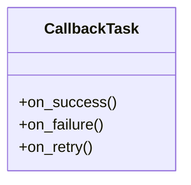

# admin_modules.data_import_export.modles.import_export_tasks

## Imports
- celery
- csv
- datetime
- django.apps
- django.conf
- django.core.files.storage
- django.core.mail
- django.db
- django.utils
- gzip
- json
- logging
- os
- pandas
- pathlib
- requests
- typing
- uuid
- xml.etree.ElementTree
- zipfile

## Classes
- CallbackTask
  - method: `on_success`
  - method: `on_failure`
  - method: `on_retry`

## Functions
- process_import_job
- process_import_file
- read_import_file
- read_csv_file
- read_excel_file
- process_export_job
- cleanup_old_files
- cleanup_old_history
- send_job_notifications
- send_email_notification
- read_json_file
- read_xml_file
- read_tsv_file
- on_success
- on_failure
- on_retry

## Module Variables
- `logger`

## Class Diagram

