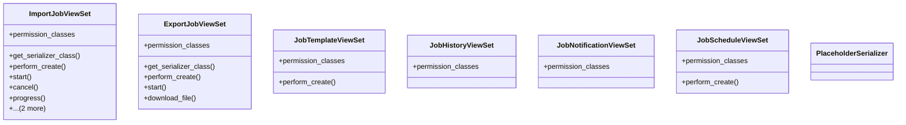

# admin_modules.data_import_export.modles.import_export_views

## Imports
- django.core.files.storage
- django.db.models
- django.http
- django.shortcuts
- django.utils
- django_filters.rest_framework
- json
- logging
- rest_framework
- rest_framework.decorators
- rest_framework.filters
- rest_framework.permissions
- rest_framework.response

## Classes
- ImportJobViewSet
  - attr: `permission_classes`
  - method: `get_serializer_class`
  - method: `perform_create`
  - method: `start`
  - method: `cancel`
  - method: `progress`
  - method: `download_source`
  - method: `download_log`
- ExportJobViewSet
  - attr: `permission_classes`
  - method: `get_serializer_class`
  - method: `perform_create`
  - method: `start`
  - method: `download_file`
- JobTemplateViewSet
  - attr: `permission_classes`
  - method: `perform_create`
- JobHistoryViewSet
  - attr: `permission_classes`
- JobNotificationViewSet
  - attr: `permission_classes`
- JobScheduleViewSet
  - attr: `permission_classes`
  - method: `perform_create`
- PlaceholderSerializer
- PlaceholderSerializer

## Functions
- import_export_stats
- get_serializer_class
- perform_create
- start
- cancel
- progress
- download_source
- download_log
- get_serializer_class
- perform_create
- start
- download_file
- perform_create
- perform_create

## Module Variables
- `logger`

## Class Diagram

