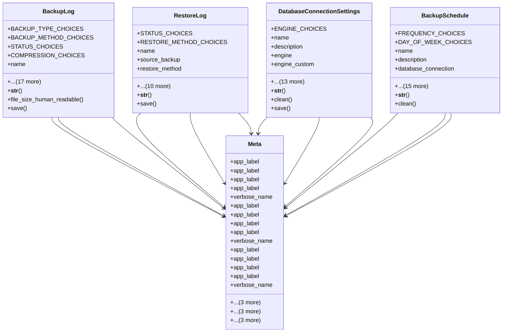

# admin_modules.database_management.models

## Imports
- django.conf
- django.core.exceptions
- django.core.validators
- django.db
- django.utils
- django.utils.translation

## Classes
- BackupLog
  - attr: `BACKUP_TYPE_CHOICES`
  - attr: `BACKUP_METHOD_CHOICES`
  - attr: `STATUS_CHOICES`
  - attr: `COMPRESSION_CHOICES`
  - attr: `name`
  - attr: `backup_type`
  - attr: `backup_method`
  - attr: `status`
  - attr: `database_name`
  - attr: `compression`
  - attr: `started_at`
  - attr: `completed_at`
  - attr: `duration_seconds`
  - attr: `file_path`
  - attr: `file_size`
  - attr: `message`
  - attr: `is_encrypted`
  - attr: `retention_days`
  - attr: `expiry_date`
  - attr: `created_by`
  - attr: `created_at`
  - attr: `updated_at`
  - method: `__str__`
  - method: `file_size_human_readable`
  - method: `save`
- RestoreLog
  - attr: `STATUS_CHOICES`
  - attr: `RESTORE_METHOD_CHOICES`
  - attr: `name`
  - attr: `source_backup`
  - attr: `restore_method`
  - attr: `status`
  - attr: `target_database`
  - attr: `started_at`
  - attr: `completed_at`
  - attr: `duration_seconds`
  - attr: `message`
  - attr: `is_overwrite`
  - attr: `created_by`
  - attr: `created_at`
  - attr: `updated_at`
  - method: `__str__`
  - method: `save`
- DatabaseConnectionSettings
  - attr: `ENGINE_CHOICES`
  - attr: `name`
  - attr: `description`
  - attr: `engine`
  - attr: `engine_custom`
  - attr: `db_name`
  - attr: `user`
  - attr: `password`
  - attr: `host`
  - attr: `port`
  - attr: `options`
  - attr: `is_active`
  - attr: `is_default`
  - attr: `allow_backup`
  - attr: `allow_restore`
  - attr: `created_at`
  - attr: `updated_at`
  - attr: `created_by`
  - method: `__str__`
  - method: `clean`
  - method: `save`
- BackupSchedule
  - attr: `FREQUENCY_CHOICES`
  - attr: `DAY_OF_WEEK_CHOICES`
  - attr: `name`
  - attr: `description`
  - attr: `database_connection`
  - attr: `backup_type`
  - attr: `frequency`
  - attr: `hour`
  - attr: `minute`
  - attr: `day_of_week`
  - attr: `day_of_month`
  - attr: `cron_expression`
  - attr: `retention_days`
  - attr: `compression`
  - attr: `is_active`
  - attr: `last_run`
  - attr: `next_run`
  - attr: `created_at`
  - attr: `updated_at`
  - attr: `created_by`
  - method: `__str__`
  - method: `clean`
- Meta
  - attr: `app_label`
  - attr: `app_label`
  - attr: `app_label`
  - attr: `app_label`
  - attr: `verbose_name`
  - attr: `verbose_name_plural`
  - attr: `ordering`
  - attr: `indexes`
- Meta
  - attr: `app_label`
  - attr: `app_label`
  - attr: `app_label`
  - attr: `app_label`
  - attr: `verbose_name`
  - attr: `verbose_name_plural`
  - attr: `ordering`
  - attr: `indexes`
- Meta
  - attr: `app_label`
  - attr: `app_label`
  - attr: `app_label`
  - attr: `app_label`
  - attr: `verbose_name`
  - attr: `verbose_name_plural`
  - attr: `ordering`
  - attr: `indexes`

## Functions
- __str__
- file_size_human_readable
- save
- __str__
- save
- __str__
- clean
- save
- __str__
- clean

## Class Diagram

