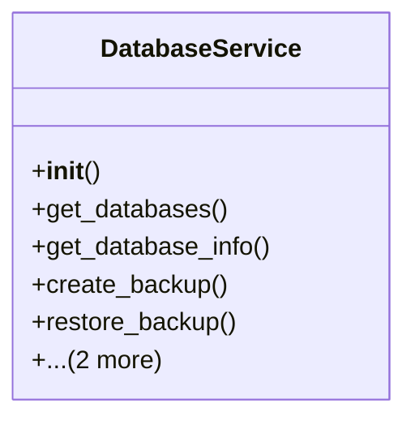

# admin_modules.database_management.services.database_service

## Imports
- datetime
- django.conf
- django.core.management
- django.core.management.base
- django.db
- json
- logging
- os
- pathlib
- subprocess
- typing

## Classes
- DatabaseService
  - method: `__init__`
  - method: `get_databases`
  - method: `get_database_info`
  - method: `create_backup`
  - method: `restore_backup`
  - method: `get_backup_list`
  - method: `delete_backup`

## Functions
- __init__
- get_databases
- get_database_info
- create_backup
- restore_backup
- get_backup_list
- delete_backup

## Module Variables
- `logger`

## Class Diagram

