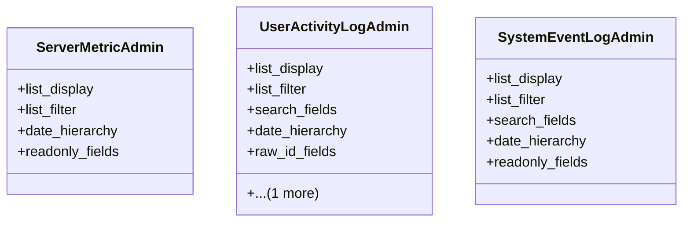

# admin_modules.health_monitoring.admin

## Imports
- django.contrib
- models

## Classes
- ServerMetricAdmin
  - attr: `list_display`
  - attr: `list_filter`
  - attr: `date_hierarchy`
  - attr: `readonly_fields`
- UserActivityLogAdmin
  - attr: `list_display`
  - attr: `list_filter`
  - attr: `search_fields`
  - attr: `date_hierarchy`
  - attr: `raw_id_fields`
  - attr: `readonly_fields`
- SystemEventLogAdmin
  - attr: `list_display`
  - attr: `list_filter`
  - attr: `search_fields`
  - attr: `date_hierarchy`
  - attr: `readonly_fields`

## Class Diagram

