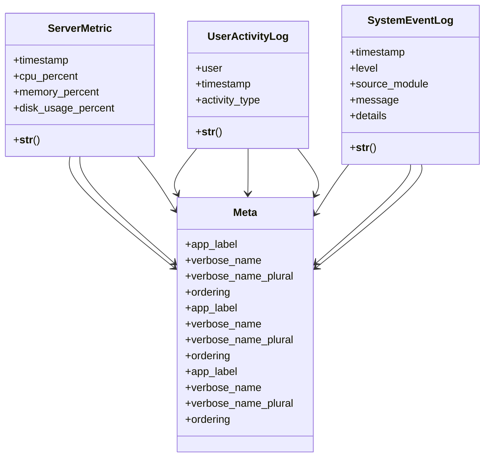

# admin_modules.health_monitoring.models

## Imports
- django.contrib.auth
- django.db
- django.utils

## Classes
- ServerMetric
  - attr: `timestamp`
  - attr: `cpu_percent`
  - attr: `memory_percent`
  - attr: `disk_usage_percent`
  - method: `__str__`
- UserActivityLog
  - attr: `user`
  - attr: `timestamp`
  - attr: `activity_type`
  - method: `__str__`
- SystemEventLog
  - attr: `timestamp`
  - attr: `level`
  - attr: `source_module`
  - attr: `message`
  - attr: `details`
  - method: `__str__`
- Meta
  - attr: `app_label`
  - attr: `verbose_name`
  - attr: `verbose_name_plural`
  - attr: `ordering`
- Meta
  - attr: `app_label`
  - attr: `verbose_name`
  - attr: `verbose_name_plural`
  - attr: `ordering`
- Meta
  - attr: `app_label`
  - attr: `verbose_name`
  - attr: `verbose_name_plural`
  - attr: `ordering`

## Functions
- __str__
- __str__
- __str__

## Module Variables
- `User`

## Class Diagram

