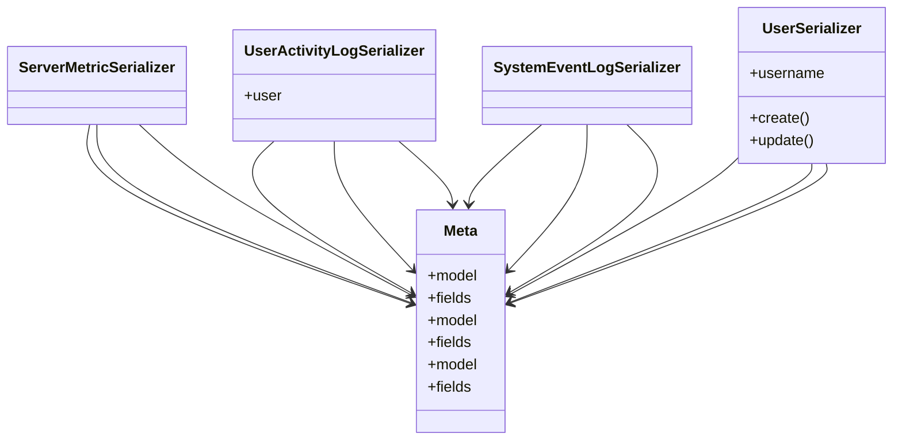

# admin_modules.health_monitoring.serializers

## Imports
- models
- rest_framework
- users_accounts.serializers

## Classes
- ServerMetricSerializer
- UserActivityLogSerializer
  - attr: `user`
- SystemEventLogSerializer
- Meta
  - attr: `model`
  - attr: `fields`
- Meta
  - attr: `model`
  - attr: `fields`
- Meta
  - attr: `model`
  - attr: `fields`
- UserSerializer
  - attr: `username`
  - method: `create`
  - method: `update`

## Functions
- create
- update

## Class Diagram

