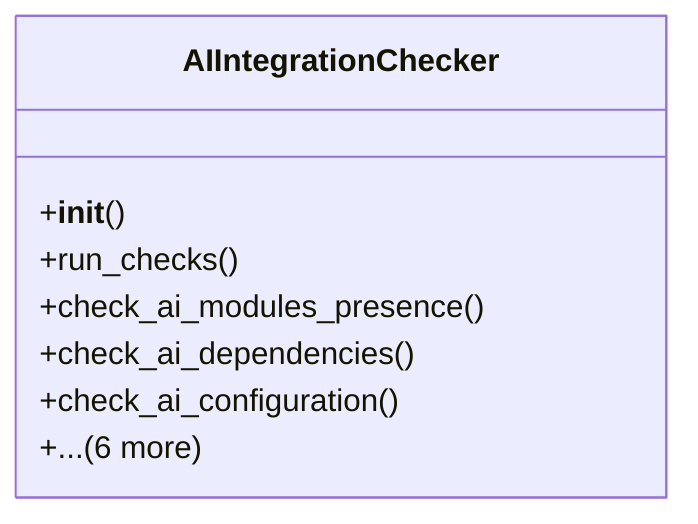

# admin_modules.internal_diagnosis_module.components.ai_integration_checker

## Imports
- django.apps
- django.conf
- django.utils
- importlib
- inspect
- models
- os
- sys

## Classes
- AIIntegrationChecker
  - method: `__init__`
  - method: `run_checks`
  - method: `check_ai_modules_presence`
  - method: `check_ai_dependencies`
  - method: `check_ai_configuration`
  - method: `check_ai_models_availability`
  - method: `check_ai_integration_in_modules`
  - method: `check_ai_memory_system`
  - method: `check_ai_agents_communication`
  - method: `_check_module_imports`
  - method: `_create_result`

## Functions
- __init__
- run_checks
- check_ai_modules_presence
- check_ai_dependencies
- check_ai_configuration
- check_ai_models_availability
- check_ai_integration_in_modules
- check_ai_memory_system
- check_ai_agents_communication
- _check_module_imports
- _create_result

## Class Diagram

