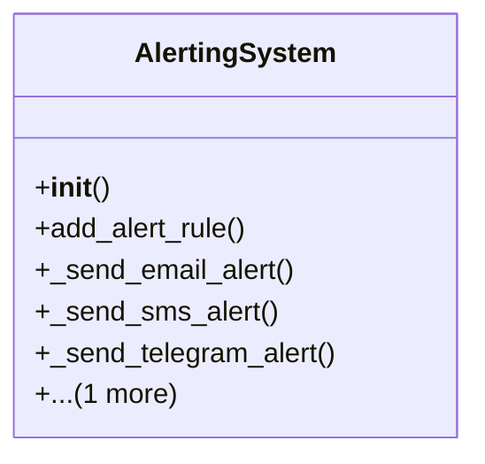

# admin_modules.internal_diagnosis_module.components.alerting_system

## Imports
- datetime
- smtplib

## Classes
- AlertingSystem
  - method: `__init__`
  - method: `add_alert_rule`
  - method: `_send_email_alert`
  - method: `_send_sms_alert`
  - method: `_send_telegram_alert`
  - method: `trigger_alerts`

## Functions
- __init__
- add_alert_rule
- _send_email_alert
- _send_sms_alert
- _send_telegram_alert
- trigger_alerts

## Class Diagram

