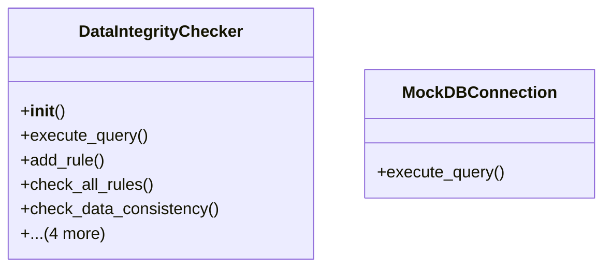

# admin_modules.internal_diagnosis_module.components.data_integrity_checker

## Classes
- DataIntegrityChecker
  - method: `__init__`
  - method: `execute_query`
  - method: `add_rule`
  - method: `check_all_rules`
  - method: `check_data_consistency`
  - method: `verify_relationships`
  - method: `identify_orphaned_data`
  - method: `get_results`
  - method: `clear_results`
- MockDBConnection
  - method: `execute_query`

## Functions
- __init__
- execute_query
- add_rule
- check_all_rules
- check_data_consistency
- verify_relationships
- identify_orphaned_data
- get_results
- clear_results
- execute_query

## Class Diagram

