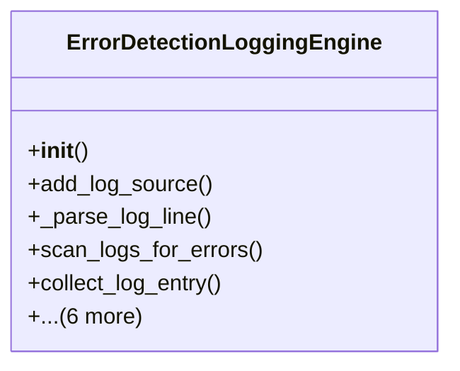

# admin_modules.internal_diagnosis_module.components.error_detection_logging_engine

## Imports
- datetime
- logging
- os
- re

## Classes
- ErrorDetectionLoggingEngine
  - method: `__init__`
  - method: `add_log_source`
  - method: `_parse_log_line`
  - method: `scan_logs_for_errors`
  - method: `collect_log_entry`
  - method: `collect_logs_from_sources`
  - method: `analyze_logs`
  - method: `classify_error_severity`
  - method: `get_collected_logs`
  - method: `get_detected_errors`
  - method: `clear_logs_and_errors`

## Functions
- __init__
- add_log_source
- _parse_log_line
- scan_logs_for_errors
- collect_log_entry
- collect_logs_from_sources
- analyze_logs
- classify_error_severity
- get_collected_logs
- get_detected_errors
- clear_logs_and_errors

## Class Diagram

