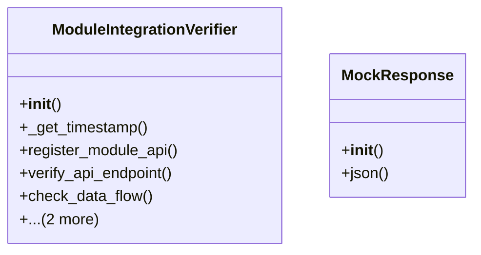

# admin_modules.internal_diagnosis_module.components.module_integration_verifier

## Imports
- datetime
- json
- requests
- time

## Classes
- ModuleIntegrationVerifier
  - method: `__init__`
  - method: `_get_timestamp`
  - method: `register_module_api`
  - method: `verify_api_endpoint`
  - method: `check_data_flow`
  - method: `get_results`
  - method: `clear_results`
- MockResponse
  - method: `__init__`
  - method: `json`

## Functions
- __init__
- _get_timestamp
- register_module_api
- verify_api_endpoint
- check_data_flow
- get_results
- clear_results
- mock_requests_get
- mock_requests_post
- __init__
- json

## Class Diagram

