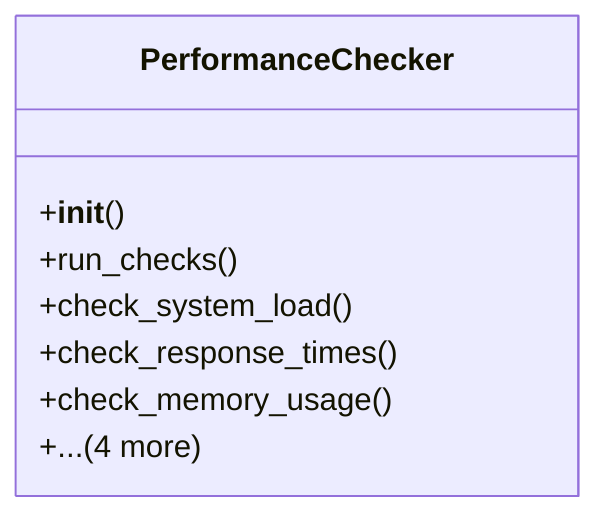

# admin_modules.internal_diagnosis_module.components.performance_checker

## Imports
- django.conf
- django.db
- django.test
- django.urls
- django.utils
- models
- psutil
- requests
- time

## Classes
- PerformanceChecker
  - method: `__init__`
  - method: `run_checks`
  - method: `check_system_load`
  - method: `check_response_times`
  - method: `check_memory_usage`
  - method: `check_api_performance`
  - method: `check_static_files_loading`
  - method: `check_database_queries_count`
  - method: `_create_result`

## Functions
- __init__
- run_checks
- check_system_load
- check_response_times
- check_memory_usage
- check_api_performance
- check_static_files_loading
- check_database_queries_count
- _create_result

## Class Diagram

