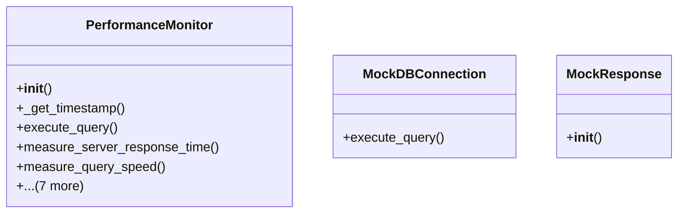

# admin_modules.internal_diagnosis_module.components.performance_monitor

## Imports
- datetime
- psutil
- requests
- time

## Classes
- PerformanceMonitor
  - method: `__init__`
  - method: `_get_timestamp`
  - method: `execute_query`
  - method: `measure_server_response_time`
  - method: `measure_query_speed`
  - method: `get_cpu_usage`
  - method: `get_memory_usage`
  - method: `get_disk_usage`
  - method: `get_system_resource_usage`
  - method: `get_network_stats`
  - method: `get_all_metrics`
  - method: `clear_metrics`
- MockDBConnection
  - method: `execute_query`
- MockResponse
  - method: `__init__`

## Functions
- __init__
- _get_timestamp
- execute_query
- measure_server_response_time
- measure_query_speed
- get_cpu_usage
- get_memory_usage
- get_disk_usage
- get_system_resource_usage
- get_network_stats
- get_all_metrics
- clear_metrics
- mock_requests_get
- execute_query
- __init__

## Class Diagram

