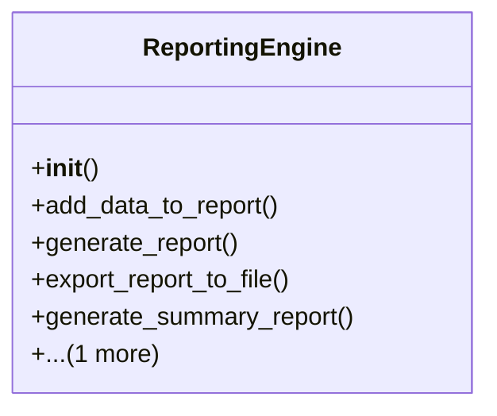

# admin_modules.internal_diagnosis_module.components.reporting_engine

## Imports
- csv
- datetime
- json
- os

## Classes
- ReportingEngine
  - method: `__init__`
  - method: `add_data_to_report`
  - method: `generate_report`
  - method: `export_report_to_file`
  - method: `generate_summary_report`
  - method: `clear_report_data`

## Functions
- __init__
- add_data_to_report
- generate_report
- export_report_to_file
- generate_summary_report
- clear_report_data

## Class Diagram

